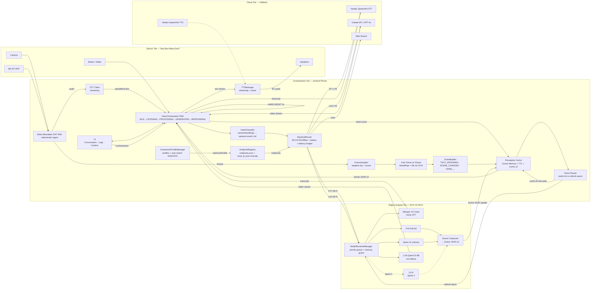
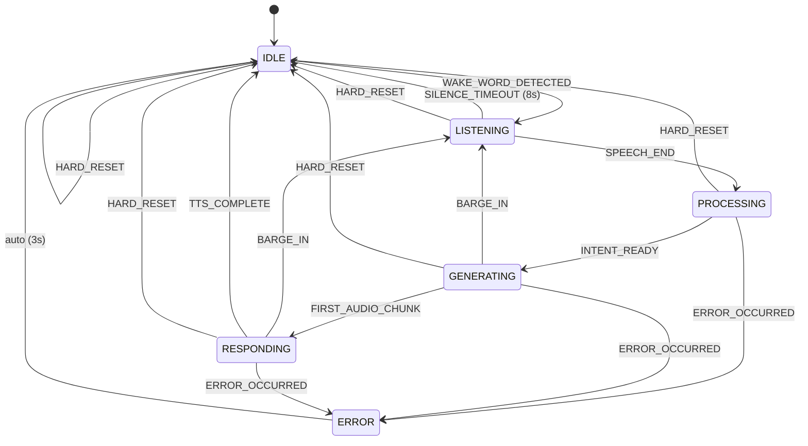
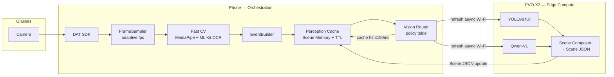
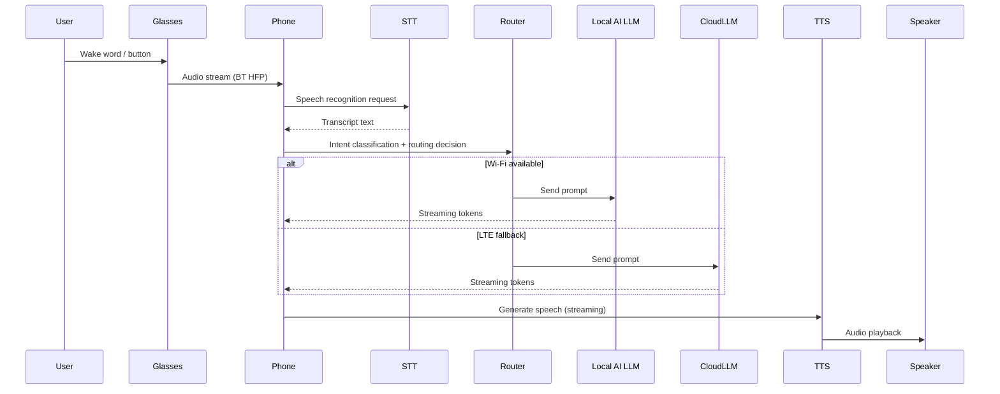
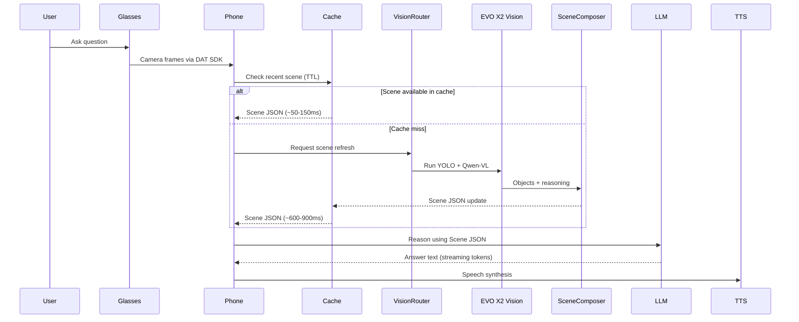
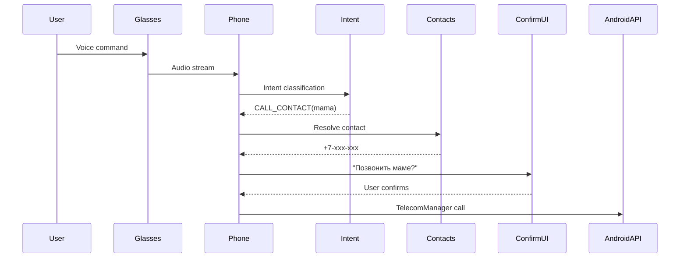

# Vzor — Architecture Specification

**Version 0.17.3 · 5 марта 2026 г.**

Единый технический документ архитектуры Vzor — русскоязычного AI-ассистента для Ray-Ban Meta Gen 2 на Android. Охватывает все принятые решения, контракты компонентов, открытые вопросы и sprint roadmap.

---

## 1. Архитектура и стек — Статус

### 1.1 Базовый репозиторий

Найден ключевой open-source проект для старта:

- ✅ **VisionClaw** ([github.com/sseanliu/VisionClaw](https://github.com/sseanliu/VisionClaw)) — 1.2k ⭐
  - Android-часть: `samples/CameraAccessAndroid/` (Kotlin, Meta DAT SDK)
  - Интеграция с Meta Wearables DAT SDK уже реализована
  - Аудио pipeline: BT HFP mic → PCM 16kHz → WebSocket
  - Что заменить: Gemini Live → Whisper+Qwen+Yandex TTS; OpenClaw → Android-native actions

- 📐 **OpenVision** ([github.com/rayl15/OpenVision](https://github.com/rayl15/OpenVision)) — эталон архитектуры (iOS, но паттерны применимы)
  - Чёткое разделение: Services / Managers / Views
  - GlassesManager, ConversationManager, AudioCaptureService — готовые паттерны для переноса

### 1.2 Гибридная архитектура роутинга — ПРИНЯТО

Три уровня обработки в зависимости от контекста:

| Контекст | LLM Backend | Латентность | Стоимость |
|---|---|---|---|
| 🏠 Дома (Wi-Fi) | AI Max: Qwen3.5-9B (Ollama) | ~150–300 мс | Бесплатно |
| 🌐 На улице (LTE) | Claude API / GPT-4o | ~400–700 мс | ~$0.01/запрос |
| ✈️ Оффлайн | Qwen3.5-4B на Fold 7 | ~1–2 с | Бесплатно |

---

### 1.3 Системная диаграмма v2 — полная архитектура Vzor



> Пунктирные стрелки — Sprint 3. **ModelRuntimeManager** на Local AI — единая точка входа для всех inference задач (priority queue: LLM > STT > Vision > YOLO > CLIP). BARGE-IN и HARD RESET — self-loop на VoiceOrchestrator. Refresh Local AI async, не блокирует голосовой путь.

### 1.4 Reading Guide — архитектура за 30 секунд

Для онбординга нового разработчика:

1. **Phone — orchestrator, не compute.** Тяжёлый AI работает на EVO X2 по Wi-Fi; облако — только fallback.
2. **VoiceOrchestrator FSM** — единственный control plane для голосового пути. Управляет streaming, barge-in, hard reset.
3. **Perception Cache** даёт быстрые ответы (~50–150ms); обновление сцены через Local AI происходит async и не блокирует голос.
4. **BackendRouter** решает где запускать каждую задачу (Wi-Fi / LTE / Offline) на основе сети, заряда, latency budget.
5. **ModelRuntimeManager** на Local AI предотвращает inference contention через priority queue и memory guard.
---

## 2. STT: Выбор движка распознавания речи

### 2.1 Сравнение вариантов

| Критерий | Whisper V3 Turbo | Yandex SpeechKit | Google Speech V2 |
|---|---|---|---|
| Качество (RU) | ⭐⭐⭐⭐ ~8% WER | ⭐⭐⭐⭐⭐ нативный RU | ⭐⭐⭐ ~17–20% WER |
| Стриминг | ❌ batch only | ✅ gRPC стриминг | ✅ стриминг |
| Латентность | ~500–800 мс (batch) | ~150–300 мс | ~200–400 мс |
| Цена | $0.006/мин | ~0.16 ₽/15 сек | $0.016/мин |
| Работает в РФ | ⚠️ нужен VPN | ✅ | ⚠️ |
| Оффлайн | ✅ локально | ❌ | ❌ |

### 2.2 Решение: Гибридная STT стратегия — ПРИНЯТО

> - Дома (Wi-Fi) → Whisper Large V3 Turbo на AI Max: ~300 мс, бесплатно, лучшее качество
> - На улице (LTE) → Yandex SpeechKit streaming: ~150 мс, нативный русский, gRPC
> - Оффлайн → Whisper Small на Fold 7: ~500 мс, базовое качество, бесплатно

### 2.3 Открытые вопросы по STT

- ⚠️ **Whisper latency (home Wi-Fi)** — ТРЕБУЕТ BENCHMARK Sprint 1. Whisper архитектурно batch-модель; whisper.cpp «streaming» реализован через window reprocessing с chunk overlap — это не настоящий streaming encoder. Заявленные 120ms — оптимистичная оценка; реальная latency на коротких фразах может быть 300–500ms при chunk_size=500ms.

  **Acceptance criteria home STT:**
  - `home_stt_p50 ≤ 300ms` на фразах 2–5 слов
  - `home_stt_p95 ≤ 600ms` на фразах 2–5 слов
  - Если не выполняется → переключить "дома" на Yandex SpeechKit streaming (те же latency что и на улице, но без трафика LTE)

  **Benchmark plan Sprint 1:**

  | Параметр | Вариант A | Вариант B | Вариант C |
  |---|---|---|---|
  | Движок | whisper.cpp streaming | faster-whisper | Yandex SpeechKit |
  | chunk_size | 500ms | 500ms | streaming |
  | overlap | 200ms | 200ms | n/a |
  | VAD | Silero | Silero | встроенный |
  | Устройство | EVO X2 | EVO X2 | Cloud |
  | Измерить | p50 / p95 TTFR* | p50 / p95 TTFR | p50 / p95 TTFR |
  | Тест фразы | 2–5 слов / 5–10 слов | 2–5 слов / 5–10 слов | 2–5 слов / 5–10 слов |

  *TTFR = Time To First Result (первый partial или финальный транскрипт)
- ❓ Нужно ли дообучить Whisper на специфической лексике (имена контактов, топонимы РФ)?
- ❓ VAD (Voice Activity Detection) — использовать Silero VAD или встроенный в Yandex SpeechKit?
- ❓ Как обрабатывать переключение языков в одном запросе (например, русско-английская речь)?
- ❓ Нужна ли пунктуация и нормализация числительных в транскрипте перед передачей в LLM?

---

## 3. Wake Word «Взор»

### 3.1 Сравнение движков

| | Porcupine (Picovoice) | openWakeWord | Своя модель |
|---|---|---|---|
| Русский язык | ✅ нативно | ⚠️ через Piper TTS RU | ✅ полный контроль |
| Время до готовности | ~10 секунд (консоль) | 4–8 часов (тренировка) | Дни/недели |
| Android SDK | ✅ готовый AAR | ✅ ONNX Runtime | — |
| Размер модели | ~1 MB (.ppn) | ~200 KB (.onnx) | — |
| Латентность | ~50 мс | ~80 мс | — |
| Ложные срабатывания | <0.1/час | ~0.5/час | — |
| Цена | Free (dev) / $499+ (prod) | 🆓 полностью бесплатно | — |
| On-device | ✅ | ✅ | ✅ |

### 3.2 Решение — ПРИНЯТО

> **Двухуровневая активация**
> - Уровень 1 — Кнопка на очках (Meta DAT SDK): мгновенная активация, нет ложных срабатываний — основной способ
> - Уровень 2 — Wake word «Взор» (Porcupine): голосовая активация без рук, для движения/вождения
> - Деактивация: «Стоп» / тишина после ответа
> - Старт: Porcupine Free Plan (личный проект — бесплатно без ограничений)
> - Эволюция: при росте в продукт → openWakeWord своя модель, обученная на AI Max overnight

### 3.3 Открытые вопросы по Wake Word

- ❓ Как работает кнопка на Ray-Ban Meta Gen 2 в Meta Wearables DAT SDK? Нужно проверить доступные события.
- ❓ Сколько слогов в «Взор» достаточно для надёжного распознавания? Рекомендация Picovoice — минимум 2–3 слога. Возможная альтернатива: «Вижу» или «Взором».
- ❓ Нужен ли персональный верификатор (speaker verification) поверх wake word для снижения FAR?
- ❓ Как вести себя при активации в фоновом режиме (Android foreground service requirements)?

---

## 3.4 Audio Environment Awareness — Sprint 2

Адаптация к акустической среде влияет на VAD, STT качество и TTS громкость. Без этого — высокий FAR на улице и неслышимые ответы в шуме.

### 3.4.1 Noise Profile Detection

```kotlin
enum class NoiseProfile {
    QUIET,      // < 40 dB — тихая комната, ночь
    INDOOR,     // 40–60 dB — офис, дом с фоновым шумом
    OUTDOOR,    // 60–75 dB — улица, парк
    LOUD        // > 75 dB — транспорт, концерт, метро
}

NoiseProfileDetector:
    Измерять RMS от BT mic каждые 2s в IDLE
    Sliding average за 10s → classify → NoiseProfile
    Обновлять не чаще 1 раза в 5s (избегать флуктуаций)
```

**Адаптация по профилю:**

| NoiseProfile | VAD threshold | STT confidence min | TTS volume | Рекомендация |
|---|---|---|---|---|
| QUIET | 0.3 | 0.7 | 50% | Wake word чувствителен |
| INDOOR | 0.5 | 0.75 | 65% | Стандарт |
| OUTDOOR | 0.7 | 0.8 | 85% | Повысить порог FAR |
| LOUD | 0.85 | 0.9 | 100% | Предложить кнопку вместо голоса |

### 3.4.2 Adaptive TTS Volume

```kotlin
TTSVolumeController:
    val baseVolume = 0.65f
    val noiseBoost = mapOf(
        QUIET   to 0.0f,
        INDOOR  to 0.0f,
        OUTDOOR to 0.2f,
        LOUD    to 0.35f
    )
    // Android AudioManager.setStreamVolume + duck других потоков
    fun targetVolume(profile: NoiseProfile) =
        (baseVolume + noiseBoost[profile]!!).coerceAtMost(1.0f)
```

### 3.4.3 Audio Fingerprinting Pipeline — место в архитектуре

Параллельный pipeline, не пересекается с Voice pipeline:

```
BT mic audio
    │
    ├── Voice pipeline (VAD → STT → LLM) ← основной
    │
    └── AudioContextDetector (Sprint 2)
            │
            ├── Music detection (RMS + spectral → is_music?)
            │       ↓ если да
            │   IntentClassifier получает hint: AUDIO_CONTEXT=MUSIC
            │       ↓ если запрос «что за песня?»
            │   audio.fingerprint tool → ACRCloud API
            │
            └── Noise profile → NoiseProfileDetector
```

> Shazam SDK требует лицензии. ACRCloud — более гибкий API для распознавания музыки. Добавить `audio.fingerprint` в Tool Registry Sprint 2. До тех пор — `action.music_id` остаётся `❓ Требует исследования`.

---

## 4. Context Manager — Управление памятью

### 4.1 Двухуровневая архитектура памяти — ПРИНЯТО

**Уровень 1 — Session Memory (RAM, живёт один сеанс)**
- История диалога: **токенный бюджет ~2048 токенов** (не фиксированное число реплик — короткие реплики вмещают больше, длинные меньше)
- При превышении бюджета → **sliding window со суммаризацией**: LLM генерирует 1–2 предложения summary для oldest messages, summary заменяет их в контексте
- Текущий контекст задачи: «обсуждаем ресторан», «ищем парковку»
- Временные данные: «где припарковался», «что покупаю»

**Уровень 2 — Persistent Memory (SQLite на телефоне)**

Хранятся только выжимки — умные предпочтения, не сырые логи:

| Таблица | Что хранится | Пример |
|---|---|---|
| contact_preferences | Предпочтения звонков и мессенджеров | Мама → всегда WhatsApp, номер +7-916-... |
| user_preferences | Личные настройки сервисов | Музыка → Spotify, навигация → Яндекс |
| learned_patterns | Обученные паттерны действий | «пробежка» → запустить плейлист Running |

### 4.2 Механизм обновления памяти — ПРИНЯТО

После каждого сеанса LLM сам решает что запомнить. Промпт:

> «Из этого разговора: есть ли что-то, что стоит запомнить для будущих сессий? Верни JSON или null.»

> **Условие вызова:** промпт памяти запускается только если сессия содержала >5 реплик. Для коротких сессий (1–5 реплик) — не вызывать, экономия LLM inference. При 50+ сессиях в день это ~90% экономии на memory update calls.

- Что **НЕ** хранить: сырые транскрипты, всё подряд
- Что хранить: «у Ивана два телефона — всегда звоним на мобильный»
- Лимит записей: ~100 строк, старые вытесняются по LRU

### 4.3 Открытые вопросы по Context Manager

- ❓ Как автоматически обновлять contact_preferences из Android Contacts API?
- ✅ **SQLite шифрование** — РЕШЕНО: SQLCipher, Sprint 2. Там имена, номера, поведенческие паттерны.
- ❓ Как обрабатывать конфликты: пользователь сказал одно, а потом передумал?
- ❓ Глубина сессии: 20 реплик — достаточно? Или нужен sliding window с суммаризацией?
- ❓ Как экспортировать/бекапировать память пользователя?

### 4.4 ConversationSession — ПРИНЯТО (Sprint 2)

Явная структура активной сессии. Живёт в RAM на время одного диалога (IDLE → ... → IDLE). Объединяет voice context, vision context и tool state в единый объект который передаётся между компонентами.

```kotlin
data class ConversationSession(
    val sessionId: String,              // UUID, новый при каждом IDLE→LISTENING
    val startedAt: Long,                // timestamp
    val messages: MutableList<Message>, // rolling window ~20 реплик
    val activeSceneId: String?,         // последний scene_id из Perception Cache
    val pendingToolCalls: MutableList<ToolCall>,    // инструменты в процессе
    val pendingMemoryWrites: MutableList<MemoryFact>, // факты для записи в SQLite
    val routingContext: RoutingContext  // текущий Wi-Fi/LTE/offline статус
)
```

**Жизненный цикл:**
- `IDLE → LISTENING` → создать новую Session (новый `sessionId`)
- `PROCESSING` → обновить `activeSceneId` из Perception Cache
- `GENERATING` → добавить tool calls в `pendingToolCalls`
- `RESPONDING → IDLE` → flush `pendingMemoryWrites` в SQLite, очистить session
- `ERROR → IDLE` → сохранить `error_code` в telemetry, очистить session

**ConversationSession vs Persistent Memory:**

| | ConversationSession | Persistent Memory (SQLite) |
|---|---|---|
| Время жизни | Одна сессия (секунды) | Постоянно |
| Хранение | RAM | Диск (SQLCipher) |
| Содержимое | Messages, tool calls, scene_id | Facts, preferences, contacts |
| Доступ | VoiceOrchestrator | Context Manager |
---

### 4.4 SessionLog — История сессий — Sprint 2

Отличается от Persistent Memory (факты) — это хронологический лог завершённых сессий для UI History экрана и команды «повтори последний ответ».

**SQLite схема:**
```sql
CREATE TABLE session_log (
    id          TEXT PRIMARY KEY,  -- UUID
    started_at  INTEGER NOT NULL,  -- unix timestamp ms
    ended_at    INTEGER,
    intent      TEXT,              -- основной intent сессии (CALL, VISION_QUERY, ...)
    query_text  TEXT,              -- транскрипт вопроса (≤200 символов)
    answer_summary TEXT,           -- 1–2 предложения ответа LLM (не полный текст)
    tools_used  TEXT,              -- JSON array: ["web.search", "action.navigate"]
    backend     TEXT,              -- "local_ai" | "cloud" | "offline"
    duration_ms INTEGER,
    had_error   INTEGER DEFAULT 0
);
-- Retention: 30 дней, затем auto-delete
-- Размер: ~500 байт/сессия × 50 сессий/день × 30 дней = ~750KB
```

**Жизненный цикл:**
```
ConversationSession начата → session_log.insert(id, started_at, ...)
FSM → IDLE (сессия завершена) → session_log.update(ended_at, answer_summary, ...)
```

**Поддержка команд:**
```
«Повтори последний ответ»
  → session_log.select ORDER BY ended_at DESC LIMIT 1
  → TTS answer_summary (не полный ответ — privacy)

«Что ты мне говорил 10 минут назад?»
  → session_log.select WHERE started_at > (now - 15min)
  → LLM: «10 минут назад ты спрашивал про {query_text}, я ответил: {answer_summary}»
```

**UI History экран:** рендерит `session_log` как список карточек — время, intent icon, query_text, answer_summary. Не хранит полный диалог (privacy).

---

## 5. Intent Router — Умная маршрутизация

### 5.1 Логика роутинга — ПРИНЯТО

Intent Router — лёгкий классификатор (возможно, Qwen3.5-0.8B) определяет:
- Сложность запроса (простой факт vs аналитика)
- Доступность сети (Wi-Fi / LTE / offline)
- Тип контента (текст / vision / action)
- Приоритет скорости vs качества

### 5.1a BackendRouter — алгоритм принятия решения

Явный алгоритм вместо неформальных rules. Для MVP — timeout ladder, не scoring formula (нет данных для калибровки весов):

### 5.1b EndpointRegistry — реестр endpoint'ов

Единый источник правды для всех адресов моделей и API. BackendRouter не хардкодит URL — берёт из EndpointRegistry. Это позволяет менять local_ai_host, добавить второй inference сервер, или переключить облачный провайдер без изменения логики роутинга.

**Конфиг файл (`endpoints.json` в assets или SharedPreferences):**

```json
{
  "local_ai": {
    "host": "192.168.1.100",
    "grpc_port": 50051,
    "health_endpoint": "/health",
    "auth": "keystore:x2_grpc_secret",
    "models": {
      "llm":     { "path": "/infer/llm",     "model_id": "qwen3.5-9b" },
      "stt":     { "path": "/infer/stt",     "model_id": "whisper-v3-turbo" },
      "vision":  { "path": "/infer/vision",  "model_id": "qwen-vl-7b" },
      "yolo":    { "path": "/infer/yolo",    "model_id": "yolov8-full" },
      "clip":    { "path": "/infer/clip",    "model_id": "clip-vit-b32" }
    }
  },
  "cloud": {
    "llm": {
      "provider": "anthropic",
      "endpoint": "https://api.anthropic.com/v1/messages",
      "model_id": "claude-opus-4-6",
      "auth": "bearer_token_env:ANTHROPIC_API_KEY"
    },
    "llm_fallback": {
      "provider": "openai",
      "endpoint": "https://api.openai.com/v1/chat/completions",
      "model_id": "gpt-4o",
      "auth": "bearer_token_env:OPENAI_API_KEY"
    },
    "stt": {
      "provider": "yandex",
      "endpoint": "https://stt.api.cloud.yandex.net/speech/v3/stt:streamingRecognize",
      "auth": "iam_token_env:YANDEX_IAM_TOKEN"
    },
    "tts": {
      "provider": "yandex",
      "endpoint": "https://tts.api.cloud.yandex.net/speech/v3/tts:utteranceSynthesis",
      "auth": "iam_token_env:YANDEX_IAM_TOKEN"
    },
    "web_search": {
      "provider": "tavily",
      "endpoint": "https://api.tavily.com/search",
      "auth": "bearer_token_env:TAVILY_API_KEY"
    },
    "translation": {
      "provider": "yandex",
      "endpoint": "https://translate.api.cloud.yandex.net/translate/v2/translate",
      "auth": "iam_token_env:YANDEX_IAM_TOKEN"
    }
  },
  "phone_local": {
    "stt": {
      "type": "whisper_cpp",
      "model_path": "/data/local/models/whisper-small.bin"
    },
    "llm": {
      "type": "llama_cpp",
      "model_path": "/data/local/models/qwen3.5-4b-q4.gguf"
    },
    "ocr": {
      "type": "ml_kit",
      "api": "com.google.mlkit.vision.text"
    }
  }
}
```

**EndpointRegistry компонент:**

```kotlin
object EndpointRegistry {
    private lateinit var config: EndpointConfig

    fun init(context: Context) {
        // Загружает из assets/endpoints.json
        // local_ai_host переопределяется из SharedPreferences (UI настройки)
        config = loadConfig(context)
    }

    fun getLocalAiEndpoint(model: ModelType): GrpcEndpoint
    fun getCloudEndpoint(service: CloudService): HttpEndpoint
    fun getPhoneLocalEndpoint(service: LocalService): LocalEndpoint

    fun overrideLocalAiHost(host: String) {
        // Для смены IP без перекомпиляции
        prefs.putString("local_ai_host_override", host)
        config.x2.host = host
    }
}
```

**Таблица всех endpoint'ов системы:**

| Сервис | Tier | Протокол | Адрес (default) | Порт | Auth |
|---|---|---|---|---|---|
| LLM inference | Local AI | gRPC streaming | 192.168.1.100 | 50051 | keystore:x2_grpc_secret |
| STT inference | Local AI | gRPC streaming | 192.168.1.100 | 50051 | keystore:x2_grpc_secret |
| Vision (Qwen-VL) | Local AI | gRPC | 192.168.1.100 | 50051 | keystore:x2_grpc_secret |
| YOLO detection | Local AI | gRPC | 192.168.1.100 | 50051 | keystore:x2_grpc_secret |
| Local AI health check | Local AI | HTTP/2 | 192.168.1.100 | 50051 | — |
| LLM fallback | Cloud | HTTPS | api.anthropic.com | 443 | API key |
| STT streaming | Cloud | HTTPS/gRPC | stt.api.cloud.yandex.net | 443 | IAM token |
| TTS synthesis | Cloud | HTTPS | tts.api.cloud.yandex.net | 443 | IAM token |
| Translation | Cloud | HTTPS | translate.api.cloud.yandex.net | 443 | IAM token |
| Web search | Cloud | HTTPS | api.tavily.com | 443 | API key |
| STT offline | Phone | In-process | whisper-small.bin | — | — |
| LLM offline | Phone | In-process | qwen3.5-4b-q4.gguf | — | — |
| OCR | Phone | In-process | ML Kit | — | — |

> local_ai_host (192.168.1.100) — переопределяется через Settings UI без перекомпиляции. Все API ключи хранятся как environment variables или Android Keystore, не в коде и не в `endpoints.json` plaintext.

```
BackendRouter.route(request):

1. if network == OFFLINE:
     → offline_backend (Whisper small + Qwen-4B on phone)

2. if battery < 20%:
     → cloud_backend (минимизировать Local AI нагрузку)

3. if network == WIFI and NOT x2_available:
     → cloud_backend  // Local AI недоступен (выключен, не отвечает на heartbeat)

4. if network == WIFI and x2_available and x2_queue_wait_ms < 800ms:
     → x2_backend

5. if network == WIFI and x2_available and x2_queue_wait_ms >= 800ms:
     → cloud_backend  // Local AI перегружен, не ждём

6. if network == LTE:
     → cloud_backend
```

**x2_available heartbeat:**
```
LocalAiHealthChecker:
  interval = 5s
  timeout = 2s
  endpoint = grpc://local-ai/health

onHeartbeatSuccess → x2_available = true
onHeartbeatFail    → x2_available = false
                     log("Local AI unreachable, routing to cloud")
```

**Timeout ladder (fallback при сбое):**

| Шаг | Условие | Действие |
|---|---|---|
| Local AI TTFT > 1500ms | Local AI не отвечает вовремя | Немедленно переключить на cloud, Local AI запрос отменить |
| Cloud TTFT > 5000ms | Cloud завис | Переключить на offline backend |
| Offline TTFT > 8000ms | Всё упало | ERROR state, сообщить пользователю |

> Scoring formula со взвешенными коэффициентами (`wL*latency + wQ*queue + wC*cost`) — открытый вопрос Sprint 3, когда будут реальные измерения для калибровки.

### 5.2 Открытые вопросы по Intent Router

- ❓ Qwen3.5-0.8B как классификатор — достаточно ли точности? Нужен ли fine-tune?
- ❓ Как обрабатывать смешанные запросы: «Посмотри на это (vision) и найди в интернете (web)»?
- ❓ Fallback стратегия: если AI Max недоступен — сразу в облако или сначала оффлайн?
- ❓ Как измерять качество роутинга и тюнить пороги?

---

## 5.3 Prompt Architecture — Sprint 1

Единый источник правды для формирования промптов. Без этого раздела два разработчика напишут промпты по-разному и получат непредсказуемые результаты.

### 5.3.1 Системный промпт — базовая структура

```
[ROLE]
Ты — Взор, голосовой AI-ассистент встроенный в умные очки Ray-Ban Meta.
Ты слышишь через микрофон очков и отвечаешь голосом через их динамики.

[LANGUAGE & TONE]
- Всегда отвечай на русском языке, даже если вопрос задан на другом языке
- Краткость критична: максимум 2–3 предложения, ~100–150 слов
- Тон: дружелюбный, уверенный, без лишних вводных слов
- Без markdown форматирования — ответ идёт прямо в TTS

[CONSTRAINTS]
- Не задавай уточняющих вопросов если можешь ответить сразу
- Не повторяй вопрос пользователя в начале ответа
- Для действий (звонок, сообщение) — всегда запрашивай подтверждение
- Если не уверен — скажи об этом коротко, не придумывай

[SCENE CONTEXT]
{{scene_block}}

[MEMORY]
{{memory_block}}

[TOOLS]
{{tools_block}}

[CONVERSATION]
{{history_block}}
```

### 5.3.2 Scene JSON → промпт (scene_block)

Scene JSON не вставляется дословно — только `scene_summary` + релевантные поля:

```python
def build_scene_block(scene: SceneResponse, query: str) -> str:
    if scene is None or scene.stability < 0.3:
        return ""  # нет достаточно стабильной сцены

    lines = [f"Текущая сцена: {scene.scene_summary}"]

    # Добавить объекты только если в запросе есть "что", "кто", "это"
    if is_vision_query(query) and scene.objects:
        obj_str = ", ".join(f"{o.label} ({o.confidence:.0%})"
                            for o in scene.objects[:5])
        lines.append(f"Объекты: {obj_str}")

    # Текст из OCR — только если есть и не пустой
    if scene.text:
        lines.append(f"Текст в кадре: {' | '.join(scene.text[:3])}")

    return "\n".join(lines)
```

### 5.3.3 Persistent Memory → промпт (memory_block)

Не все факты — только релевантные к текущему запросу:

```python
def build_memory_block(memory: List[MemoryFact], query: str,
                        max_facts: int = 10) -> str:
    if not memory:
        return ""

    # Фильтрация: cosine similarity query embedding vs fact embedding
    # Берём top-N наиболее релевантных
    relevant = rank_by_relevance(memory, query, top_n=max_facts)

    if not relevant:
        return ""

    lines = ["Что я знаю о пользователе:"]
    for fact in relevant:
        lines.append(f"- {fact.text}")
    return "\n".join(lines)
```

> Без фильтрации 100 фактов могут занять ~2000 токенов — половину контекстного окна модели.

### 5.3.4 Tool Registry → промпт (tools_block)

Инструменты описываются кратко, только те что разрешены в текущем режиме:

```python
def build_tools_block(available_tools: List[Tool],
                       mode: AppMode) -> str:
    # Фильтр: в offline режиме — только memory.*, без web.search
    tools = [t for t in available_tools if t.available_in(mode)]

    descriptions = []
    for tool in tools:
        descriptions.append(
            f"- {tool.name}: {tool.description}"
        )
    return "Доступные инструменты:\n" + "\n".join(descriptions)
```

### 5.3.5 Qwen (local AI) vs Claude (cloud) — различия промптов

| Параметр | Qwen3.5-9B (Local AI) | Claude API (Cloud) |
|---|---|---|
| System prompt | Короткий, ≤500 токенов | Полный, до 2000 токенов |
| Tool calling | Qwen function calling format | Anthropic tool_use format |
| Scene block | Всегда включать | Включать только при vision query |
| Memory block | top-5 фактов (экономия) | top-10 фактов |
| Max output tokens | 200 | 300 |
| Temperature | 0.3 (предсказуемость) | 0.5 |
| Язык инструкций | Английский (лучше следует) | Русский или английский |

> Промпты хранятся как шаблоны в `assets/prompts/` — отдельные файлы для Qwen и Claude. Не хардкодить в коде.

### 5.3.6 Max tokens и длина ответа

```
Голосовой ассистент: max_tokens = 200 (≈ 100–150 слов, ~20–30 секунд TTS)
Vision description: max_tokens = 150 (краткое описание сцены)
Tool result summary: max_tokens = 100 (подтверждение действия)

Если LLM превысил лимит → TTS обрезает на последнем полном предложении,
не на середине слова. SentenceSegmenter обрабатывает это автоматически.
```

---

## 6. Android Actions — Интеграции

### 6.1 Статус интеграций

| Функция | Android API | Статус |
|---|---|---|
| Звонки hands-free | TelecomManager + Intent.ACTION_CALL | 🔲 Не реализовано |
| WhatsApp сообщения | WhatsApp Business API / Intent | 🔲 Не реализовано |
| Telegram сообщения | Telegram Bot API или Intent | 🔲 Не реализовано |
| Управление музыкой | Android MediaSession API | 🔲 Не реализовано |
| Навигация | Яндекс.Карты Intent / Google Maps | 🔲 Не реализовано |
| Напоминания / таймеры | AlarmManager + NotificationManager | 🔲 Не реализовано |
| Shazam (распознавание) | Shazam API или ACRCloud | ❓ Требует исследования |

### 6.2 Открытые вопросы по Actions

- ❓ WhatsApp: Business API требует верификацию. Есть ли Intent-based альтернатива без API?
- ❓ Как обрабатывать неоднозначные контакты: «Позвони Саше» при нескольких Александрах?
- ❓ Нужна ли подтверждающая реплика перед отправкой сообщения / звонком?

---

## 7. TTS — Синтез речи

### 7.1 Решение — ПРИНЯТО

> - **Основной:** Yandex SpeechKit TTS — лучший русский голос, 4 ₽/1000 символов, первый 1М бесплатно
> - **Резервный:** Google TTS — при недоступности Яндекса
> - **Оффлайн:** Android built-in TTS (низкое качество, но работает без сети)

### 7.2 Streaming TTS Pipeline — ПРИНЯТО (Sprint 2)

Для длинных ответов LLM нельзя ждать полного текста перед синтезом — это добавляет 1–3s задержки. Решение: pipeline из трёх буферов.

```
LLM token stream
      ↓
TokenBuffer
(накапливает токены)
      ↓
SentenceSegmenter
(разбивает на фразы по . ? ! ; и паузам)
      ↓
TTS synthesis queue
(Yandex SpeechKit streaming API)
      ↓
AudioQueue
(буфер аудио чанков)
      ↓
BT HFP playback → Speakers
```

**Правила сегментации:**
- Минимальная фраза для TTS: ~5 слов (меньше → awkward паузы)
- Максимальный буфер TokenBuffer: 200ms или 20 токенов (что раньше)
- AudioQueue размер: 2–3 чанка (≈1–1.5s аудио) — защита от jitter

**SentenceSegmenter псевдокод:**
```
SentenceSegmenter.onToken(token):
    buffer.append(token)
    word_count = buffer.wordCount()

    if token in ['.', '?', '!', ';'] and word_count >= 5:
        flush(buffer)  // отправить в TTS queue
        buffer.clear()

    elif buffer.age_ms >= 200:  // max wait — не держим дольше
        if word_count >= 3:    // минимум 3 слова при flush по таймеру
            flush(buffer)
            buffer.clear()

    // else: накапливаем дальше

SentenceSegmenter.onStreamEnd():
    if buffer.wordCount() > 0:
        flush(buffer)  // flush остатка
```

**Cancel chain при BARGE-IN:**
```
BARGE_IN event:
  1. VoiceOrchestrator → LISTENING (немедленно)
  2. cancel LLM stream (gRPC cancel / HTTP abort)
  3. cancel pending Yandex TTS requests
  4. AudioQueue.clear()
  5. SentenceSegmenter.reset()
  6. TokenBuffer.clear()

Гарантия: аудио замолкает в течение одного AudioQueue чанка (~500ms).
```

**Phrase cache** для системных фраз (не синтезировать повторно):

| Фраза | Кэш |
|---|---|
| «Понял» | ✅ pre-synthesized |
| «Выполняю» | ✅ pre-synthesized |
| «Не слышу вас» | ✅ pre-synthesized |
| «Ошибка, попробуйте снова» | ✅ pre-synthesized |
| «Позвонить [имя]?» | ⚡ синтез с именем на лету |

### 7.3 Открытые вопросы по TTS

- ❓ Какой голос Yandex выбрать? Alena, Filipp, Ermil — нужно тестирование.
- ❓ Yandex SpeechKit streaming TTS — проверить latency первого аудио чанка на реальном соединении (ориентир: <200ms).

---

## 8. Следующие шаги — Приоритизация

### 8.1 Sprint 1 — Прототип (1–2 недели)

> **Цель: «Взор» слышит и отвечает через очки**
> - Fork VisionClaw Android → убрать Gemini, подключить Whisper API
> - Создать «Взор» wake word в Picovoice Console (10 минут)
> - Интегрировать Porcupine SDK в Android app
> - Подключить Yandex SpeechKit TTS
> - Тест: сказать «Взор, какая погода?» → ответ через динамики очков

### 8.2 Sprint 2 — Роутинг и AI (2–3 недели)

- Поднять Ollama + Qwen3.5-9B на AI Max
- Реализовать Intent Router (Wi-Fi → AI Max, LTE → Claude API)
- Подключить Yandex SpeechKit STT для стриминга
- Тест: сравнить латентность всех трёх режимов

### 8.3 Sprint 3 — Vision и Actions (3–4 недели)

- Vision pipeline: кадры с камеры → Qwen3.5-4B/9B → описание
- Contact preferences: SQLite + Android Contacts API
- Звонки: TelecomManager интеграция
- Сообщения: WhatsApp/Telegram intent-based

### 8.4 Sprint 4 — Полировка (ongoing)

- Context Manager: персистентная память, LRU
- Конвертация openWakeWord модели на AI Max (overnight training)
- Оффлайн режим: Whisper Small + Qwen3.5-4B на Fold 7
- Тестирование в реальных условиях: улица, шум, движение

### 8.5 Implementation Checklist — Sprint 1–2

Операционный чеклист для отслеживания прогресса:

- [ ] DAT ingest + BT audio capture
- [ ] VoiceOrchestrator FSM + HARD_RESET + barge-in
- [ ] STT: Whisper (Local AI) + Yandex streaming (LTE) + offline fallback
- [ ] TTS: Yandex (primary) + built-in fallback + phrase cache
- [ ] FrameSampler adaptive fps (1 / 5–10 / 15 + bursts)
- [ ] Perception Cache + Vision Router policy table
- [ ] Confirm UI для Actions
- [ ] Telemetry: `llm_first_token_ms`, `tts_first_audio_ms`, `barge_in_count`, `fallback_count`
- [ ] **`scene.proto` — зафиксировать Scene JSON v2 как protobuf контракт.** Автогенерация Kotlin data classes (phone) и Python dataclasses (Local AI host). Это контракт между двумя сервисами, не документация — должен жить в репо как код Sprint 1.
- [ ] **`endpoints.json` + EndpointRegistry** — конфиг всех API endpoint'ов (Local AI gRPC, Cloud APIs, phone-local). local_ai_host переопределяется из Settings UI без перекомпиляции.

### 8.6 Decision Gates — критерии перехода между спринтами

Явные измеримые критерии. Не переходить к следующему спринту пока Gate не пройден.

**Gate Sprint 1 → Sprint 2:**

| Критерий | Target | Метод измерения |
|---|---|---|
| DAT ingest стабильность | 0 dropped frame bursts за 5 минут теста | Logcat + FrameSampler счётчик |
| home STT p50 | ≤ 300ms | Benchmark script, 50 фраз 2–5 слов |
| home STT p95 | ≤ 600ms | Benchmark script |
| End-to-end latency (voice → audio) | p50 ≤ 2s в Wi-Fi режиме | Ручной замер wake_to_audio_ms |
| Barge-in работает | Аудио замолкает ≤ 500ms после прерывания | Ручной тест × 10 |
| Crash-free rate | 0 ANR / crash за 30 минут use | Android Vitals / Logcat |
| `scene.proto` существует в репо | Kotlin + Python классы генерируются без ошибок | `protoc` build step в CI |

**Gate Sprint 2 → Sprint 3:**

| Критерий | Target | Метод измерения |
|---|---|---|
| Local AI queue contention | `x2_queue_wait_ms` p95 ≤ 200ms | Telemetry dashboard |
| Perception Cache hit rate | ≥ 60% запросов из кэша | `perception_cache_hit_rate` |
| Vision latency (cache miss) | p50 ≤ 900ms | Telemetry `vision_refresh_ms` |
| Cloud fallback работает | Ответ при Local AI offline ≤ 3s | Ручной тест (выключить Local AI) |
| VisionBudgetManager не flood | `vision_rate_limited_count` < 5% от refresh запросов | Telemetry |

---

## 9. Технический стек — Сводка

| Компонент | Решение | Статус |
|---|---|---|
| Android App | Kotlin + Jetpack Compose | ✅ Выбрано |
| Meta SDK | Meta Wearables DAT (GitHub Packages) | ✅ Выбрано |
| Базовый репо | VisionClaw Android fork | ✅ Выбрано |
| Wake Word | Porcupine Free → openWakeWord | ✅ Выбрано |
| STT (дома) | Whisper V3 Turbo на AI Max | ✅ Выбрано |
| STT (улица) | Yandex SpeechKit streaming | ✅ Выбрано |
| STT (оффлайн) | Whisper Small on-device | ✅ Выбрано |
| LLM (дома) | Qwen3.5-9B via Ollama (AI Max) | ✅ Выбрано |
| LLM (улица) | Claude API / GPT-4o | ✅ Выбрано |
| LLM (оффлайн) | Qwen3.5-4B on Fold 7 (MLC LLM) | ✅ Выбрано |
| Vision | Qwen3.5 нативный multimodal | ✅ Выбрано |
| TTS | Yandex SpeechKit (основной) | ✅ Выбрано |
| Persistent Memory | SQLite (Android) | ✅ Выбрано |
| Intent Router | Qwen3.5-0.8B классификатор | 🔲 Прототип |
| Android Actions | TelecomManager + Intents | 🔲 Не реализовано |

---

## 10. TTS — Мультиязычность

### 10.1 Решение — ПРИНЯТО

> - `ru` → Yandex SpeechKit TTS (голос Alena / Filipp)
> - `en` → Google Cloud TTS (голос en-US-Neural2) + Yandex как резервный
> - `offline` → Android built-in TTS (любой язык, низкое качество)

### 10.2 Архитектура TTSManager

```kotlin
class TTSManager(private val prefs: UserPreferences) {
    fun speak(text: String) {
        val segments = LanguageDetector.split(text)
        segments.forEach { (lang, chunk) ->
            when (lang) {
                "ru" -> yandexTTS.synthesize(chunk, voice = prefs.voiceRu, lang = "ru-RU")
                "en" -> googleTTS.synthesize(chunk, voice = prefs.voiceEn, lang = "en-US")
            }
        }
    }
}
```

### 10.3 Автодетекция языка (микс RU+EN)

- **Подход:** Unicode script detection — кириллица → `ru`, латиница → `en`. Библиотека: Apache Tika LanguageDetector или простая эвристика по скрипту.
- **Алгоритм:** разбить по токенам → сгруппировать соседние токены одного языка → синтезировать последовательно с минимальными паузами.
- **Пример:** `"Найди в Spotify плейлист Running"` → `[ru: Найди в] [en: Spotify] [ru: плейлист] [en: Running]` — 4 сегмента, чередование Yandex/Google.

### 10.4 Подтверждение смены языка голосом

При смене языка TTSManager озвучивает подтверждение уже на новом языке:
- RU → Yandex (Alena): *«Привет! Я теперь говорю по-русски.»*
- EN → Google TTS (en-US-Neural2): *«Hello! I'm now speaking in English.»*

### 10.5 Хранение настроек в SQLite

```sql
-- user_preferences
app_language    = 'ru' | 'en'
tts_voice_ru    = 'alena' | 'filipp' | 'ermil'
tts_voice_en    = 'en-US-Neural2-F' | 'en-US-Neural2-D'
```

### 10.6 Открытые вопросы

- ✅ Автодетекция языка — РЕШЕНО: Unicode script detection, сегментация по токенам
- ✅ EN TTS движок — РЕШЕНО: Google Cloud TTS (Neural2) + Yandex резервный
- ✅ Подтверждение смены языка — РЕШЕНО: озвучивать на новом языке сразу после смены
- ❓ Минимальная пауза между сегментами при чередовании RU/EN — нужно тестирование (50ms? 100ms?)
- ❓ Кэш фраз подтверждения — нужны отдельные кэши для RU и EN версий
- ❓ STT для EN — нужен ли другой STT endpoint при переключении на английский?

---

## 11. Синхронный перевод

Отдельный режим работы Vzor, активируемый голосом или кнопкой. Поддерживает три сценария: слушаю собеседника, говорю сам, двусторонний.

### 11.1 Сценарии использования

**Сценарий A — Слушаю собеседника (A→B)**

Собеседник говорит по-английски — Vzor переводит и озвучивает в наушник по-русски. Задержка ~800–1200ms. Текст параллельно на экране телефона.

```
BT mic → VAD → STT(en) → MT → TTS(ru) → наушник + экран
```

> ⚠️ **Открытый вопрос Sprint 1 — BT HFP mic направленность.** Микрофон Ray-Ban Meta Gen2 оптимизирован для голоса носителя, не собеседника. На расстоянии 1–2 метра качество записи речи собеседника неизвестно. **Тест Sprint 1:** записать речь собеседника на расстоянии 1м и 2м через mic очков, оценить качество STT (target WER < 20%). Если неприемлемо — сценарий A деградирует до «телефон на столе» (mic телефона, не очков).

**Сценарий B — Говорю сам (B→A)**

Я говорю по-русски — Vzor переводит на английский. Два варианта доставки собеседнику:
- 📱 **Телефон на столе:** TTS(en) через динамик телефона — собеседник слышит перевод вслух
- 👂 **Подсказка в ухо:** перевод в наушник, я повторяю вслух собеседнику

```
BT mic → VAD → STT(ru) → MT → TTS(en) → телефон динамик | наушник
```

**Сценарий C — Двусторонний (A⇄B) — Sprint 2+**

Оба направления одновременно. Требует AEC и управления очерёдностью речи.

```
mic(BT) → VAD → speaker_id → route A|B → MT → TTS → наушник | динамик
```

> ⚠️ Требует: AEC (Android AcousticEchoCanceler), speaker diarization или push-to-talk, очередь TTS с приоритетами

### 11.2 Активация

- 🎙️ Голос: «Взор, переводи» → A; «Взор, переводи мою речь» → B; «Взор, двусторонний перевод» → C
- 📱 Кнопка в приложении: экран «Перевод» в нижней навигации (Sprint 2)
- ⏹️ Остановка: «Взор, стоп» — сохраняет расшифровку в историю

> ★ **Sprint 1–2 — Push-to-talk как единственный UX перевода.** Удерживать кнопку на очках → говорить → отпустить → получить перевод. Это проще в реализации (нет AEC, нет speaker diarization), предсказуемо для пользователя, и надёжно работает с BT HFP. Сценарии A и B через push-to-talk покрывают 90% use cases.
>
> ⛔ **Режим C (двусторонний автоматический перевод) — Research Gate.** Требует: (1) надёжный AEC поверх BT HFP — нетривиально, (2) speaker diarization в реальном времени — отдельная ML задача, (3) latency бюджет STT→MT→TTS ~1.5–2s — может быть неприемлем для живого разговора. **Критерии разблокировки:** AEC работает без echo artifacts в 95% тестов AND diarization точность ≥ 90% AND latency p50 ≤ 1.5s. До выполнения критериев — режим C не в roadmap.

### 11.3 Движок перевода (MT)

| Режим | Движок | Задержка | Примечание |
|---|---|---|---|
| Online (Wi-Fi/LTE) | Yandex Translate API (основной) / DeepL (резерв) | ~150–300ms | Лучший RU↔EN |
| Offline (fallback) | Google ML Kit Translate (on-device) | ~50ms | ~30MB модель скачивается заранее |
| Контекстный | Qwen / Claude (LLM) + контекст разговора | ~500ms+ | Для имён, терминов, сарказма |

### 11.4 Вывод перевода

- 👂 **Наушник (TTS):** основной канал для сценария A
- 📱 **Телефон на столе (динамик):** для переговоров, встреч, кафе
- 📝 **Текст на экране:** субтитры — оригинал + перевод параллельно

### 11.5 Проблема эхо-петли (AEC) — Sprint 2+

- **Android AcousticEchoCanceler** — применяется к AudioRecord-сессии BT HFP
- **Mute mic во время TTS** — простое решение, но пропускает речь собеседника
- **Push-to-talk** — полностью исключает эхо, надёжно для Sprint 1

### 11.6 Открытые вопросы

- ❓ AEC с BT HFP — насколько хорошо работает? Нужно тестирование на устройстве
- ❓ VAD порог — как отличить фоновый шум от речи в шумной среде?
- ❓ Языковые пары — Sprint 1 только RU⇄EN. Расширять ли на DE, ZH, ES?
- ❓ Задержка 1–2с — психологически комфортна? Нужно пользовательское тестирование
- ❓ Громкость TTS через телефонный динамик — отдельный слайдер или стандартный media volume?
- 📌 Приоритет: A (Sprint 1) → B с динамиком телефона (Sprint 1) → Подсказка в ухо (Sprint 2) → C (Sprint 2+)

---

## 12. VoiceOrchestrator (FSM) — ПРИНЯТО

> 📋 **ADR-ARCH-001** · Статус: ПРИНЯТО (частично) · 2026-03-04

Без централизованного контроллера возникают гонки между STT, TTS и Actions: двойные ответы, невозможность barge-in, непредсказуемые таймауты. VoiceOrchestrator как FSM решает эти проблемы детерминированно. Принято для реализации в Sprint 2.

### 12.1 Состояния FSM



| Состояние | Что делает Orchestrator | UI |
|---|---|---|
| IDLE | Слушает wake word через openWakeWord | Пульсирующий индикатор |
| LISTENING | STT streaming, VAD, partial transcript. Timeout 8s → IDLE | Waveform + partial transcript |
| PROCESSING | IntentClassifier + BackendRouter + LLM inference start | Spinner «Думаю...». Кнопка Stop активна |
| GENERATING | LLM streaming tokens → TTS buffer. Streaming TTS с первого предложения | Текст по мере генерации. Barge-in активен. ★ |
| RESPONDING | TTS воспроизводит финальный ответ. LLM уже завершил | Анимация звуковых волн. Barge-in активен |
| CONFIRMING | Ожидание подтверждения destructive action (звонок, сообщение). TTS воспроизвёл вопрос «Позвонить маме?» | Confirm UI (bottom sheet: Да / Отмена). Timeout 10s → IDLE |
| SUSPENDED | AudioFocus потерян (входящий звонок, другое приложение). Vzор не слышит и не говорит | Badge «Приостановлено». Авто-выход → IDLE при восстановлении AudioFocus |
| PAUSED | Кратковременная потеря AudioFocus (навигация, уведомление) | Пауза TTS. Авто-возобновление ≤3s или → SUSPENDED |
| ERROR | Логирует ошибку в Telemetry. Авто-сброс в IDLE через 3s | Красный badge + сообщение об ошибке |

> ★ Состояние GENERATING добавлено к оригинальному ADR-ARCH-001. Разделение PROCESSING/GENERATING важно для barge-in: прерывать можно уже при GENERATING, не дожидаясь RESPONDING.

> ★ Состояние CONFIRMING добавлено для destructive/sensitive actions. Переходы: GENERATING → CONFIRMING (если `confirm_required=true` в BackendRouter); CONFIRMING → IDLE (Да → выполнить action → IDLE; Отмена → IDLE; Timeout 10s → IDLE). BARGE-IN в CONFIRMING → IDLE без выполнения.

### 12.2 IntentClassifier и BackendRouter

| Компонент | Ответственность | Реализация Sprint |
|---|---|---|
| IntentClassifier | **ЧТО** хочет пользователь. Intent + confidence + slots. On-device, <50ms. | Sprint 1: embedding similarity (bge-small / e5-small + cosine, <5ms) → Sprint 2: Qwen3.5-0.8B для сложных интентов |
| BackendRouter | **ГДЕ** исполнять. local/cloud/offline, режим STT/TTS, confirm required, fallback стратегия | Sprint 2: простые правила → Sprint 3: расширенный |

> ★ **IntentClassifier Sprint 1 — embedding similarity:** `embedding(transcript)` → cosine similarity по базе известных интентов (CALL, NAVIGATE, PLAY_MUSIC, TRANSLATE, VISION_QUERY, ...). Latency <5ms, стабильнее LLM классификатора, не требует inference. Qwen-0.8B добавляется в Sprint 2 для интентов с open-ended slots («напомни мне через X минут», «переведи вот это»).

> ❓ **Slot extraction и составные интенты (Sprint 2)** — embedding similarity плохо работает с составными командами типа «Позвони Саше и скажи что опоздаю» (два интента: CALL + MESSAGE). Нужен hybrid pipeline: `intent classification → slot extraction`. Варианты: Qwen-0.8B с CoT prompt для slot filling, или rule-based NER для имён контактов + intent classifier. Оценить в Sprint 2 на реальных примерах.

> ★ **BackendRouter — policy engine:** при принятии решения local/cloud/offline учитываются четыре фактора: наличие сети (Wi-Fi / LTE / нет), уровень заряда (<20% → минимизировать облачные вызовы), latency budget (голосовой ответ <2s → приоритет local EVO X2 над cloud), **x2_queue_wait_ms** (если очередь на X2 >800ms → route сразу в Cloud, не ждать). Последнее предотвращает ситуацию «X2 занят, но router всё равно шлёт туда».

### 12.2a Event Model — события FSM

Состояния FSM описывают **ЧТО** происходит. События описывают **ПОЧЕМУ** происходит переход.

| Событие | Переход | Источник |
|---|---|---|
| `WAKE_WORD_DETECTED` | IDLE → LISTENING | openWakeWord |
| `SPEECH_END` | LISTENING → PROCESSING | VAD (silence detection) — основной механизм. Три варианта реализации с разной latency: (1) **on-device Silero VAD** ~50ms задержки, рекомендуется Sprint 1; (2) **STT endpoint detection** (Yandex SpeechKit вернёт финальный transcript) ~200–400ms; (3) **silence timeout** (3s тишины) — fallback. Для Sprint 1: Silero VAD на phone генерирует SPEECH_END, STT продолжает работать параллельно и обновит transcript при поступлении. |
| `INTENT_READY` | PROCESSING → GENERATING | IntentClassifier + BackendRouter |
| `FIRST_AUDIO_CHUNK` | GENERATING → RESPONDING | TTSManager (первый chunk) |
| `TTS_COMPLETE` | RESPONDING → IDLE | TTSManager (playback end) |
| `BARGE_IN` | GENERATING \| RESPONDING → LISTENING | VAD (речь во время ответа) |
| `SILENCE_TIMEOUT` | LISTENING → IDLE | VAD timer (8s) |
| `ERROR_OCCURRED` | \* → ERROR | любой компонент pipeline |
| `HARD_RESET` | \* → IDLE | кнопка очков (long press 2s) |

### 12.3 Telemetry — метрики Orchestrator

Каждый переход FSM логирует:

```
wake_to_stt_ms           // IDLE → LISTENING latency
stt_latency_ms           // LISTENING → PROCESSING
route_reason             // "local_fast" | "cloud_quality" | "offline_fallback"
llm_first_token_ms       // PROCESSING → GENERATING (time to first token)
tts_first_audio_ms       // GENERATING → первый аудио-chunk
fallback_count           // сколько раз BackendRouter переключился на fallback
confirm_rate             // % запросов потребовавших confirm UI
barge_in_count           // сколько раз пользователь прервал ответ
session_duration_ms      // полное время сессии IDLE → IDLE
error_code               // STT_TIMEOUT | LLM_UNAVAILABLE | TTS_FAIL | NETWORK_ERR
perception_cache_hit_rate // % запросов отвеченных из кэша без Local AI inference (target: >60%)
x2_queue_wait_ms         // время ожидания в очереди inference на EVO X2 (target: <100ms)
vad_false_positive_rate  // ложные срабатывания VAD / wake word в час (target: <0.5/ч)
vision_rate_limited_count // сколько раз VisionBudgetManager блокировал Local AI запрос
profile_switch_reason     // причина смены профиля: manual / ssid / geo / default (Sprint 3)
interruption_count        // сколько раз FSM перешёл в SUSPENDED/PAUSED за сессию
audio_focus_loss_ms       // суммарное время потери AudioFocus
```

**Sampling и retention policy:**

| Параметр | Значение | Обоснование |
|---|---|---|
| Sampling rate | 100% сессий в dev, 20% в prod | Полный сбор нужен при отладке, избыточен в production |
| Retention | 7 дней локально на phone | Достаточно для анализа паттернов, не раздувает хранилище |
| Low battery mode | Telemetry отключена при <15% заряда | Battery drain важнее метрик |
| PII scrubbing | Транскрипты не логируются, только агрегированные метрики | Текст запроса — приватные данные |
| Flush policy | Запись в SQLite после каждой сессии, не realtime | Избегаем частых disk writes |

### 12.4 Voice State UI — ADR-DES-001 ПРИНЯТО с дополнениями

Компонент Voice State Indicator синхронизируется с FSM Orchestrator. Добавлены два уточнения:

- **Hard reset:** долгое нажатие кнопки на очках (2s) → принудительный сброс в IDLE из любого состояния
- **OFFLINE scope:** доступны: wake word, STT (Whisper on-device), LLM (Qwen на EVO X2 по Wi-Fi или on-device). Недоступны: Yandex TTS → fallback на Android built-in TTS, облачный поиск, Actions требующие сети. UI показывает badge «Офлайн».

### 12.5 Что не принято и почему

| Предложение | Обоснование |
|---|---|
| ❌ Policy/Safety компонент (ADR-ARCH-001) | Scope не определён: что фильтрует, какие Actions блокирует, на каком уровне стека. Confirm UI из ADR-DES-001 покрывает основной кейс на Sprint 1–2. Вернуть когда будет понятен список Actions. |
| ❌ ADR-OQ-001 как отдельный ADR | ADR фиксирует архитектурные решения, не задачи по документации. Содержание интегрировано в разделы 12.1–12.3. |
| ⚠️ PROCESSING как единственное промежуточное состояние | Не отклонено, а расширено: добавлено состояние GENERATING для поддержки streaming TTS и barge-in во время генерации. |

### 12.6 Tool Registry — ПРИНЯТО (Sprint 2)

LLM вызывает инструменты имплицитно через BackendRouter. Явная схема инструментов делает систему расширяемой и позволяет LLM выбирать tool по имени и описанию.

| Tool | Описание | Где исполняется | Sprint |
|---|---|---|---|
| `vision.getScene` | Получить текущую Scene JSON из Perception Cache | Phone (PC) | Sprint 1 |
| `vision.describe` | Описать объект / текст на кадре через Qwen-VL | EVO X2 | Sprint 2 |
| `web.search` | Поиск в интернете | Cloud | Sprint 2 |
| `action.call` | Позвонить контакту (TelecomManager) | Phone (Android API) | Sprint 3 |
| `action.message` | Отправить сообщение (WhatsApp/Telegram intent) | Phone (Android API) | Sprint 3 |
| `action.navigate` | Открыть навигацию (Яндекс.Карты intent) | Phone (Android API) | Sprint 3 |
| `action.playMusic` | Управление музыкой (MediaSession) | Phone (Android API) | Sprint 3 |
| `action.capture` | Сохранить текущий кадр (фото) в галерею / контакты / память | Phone (FrameSampler + MediaStore) | Sprint 2 |
| `memory.get` | Получить факт из Persistent Memory (SQLite) | Phone (SQLite) | Sprint 2 |
| `memory.set` | Сохранить факт в Persistent Memory | Phone (SQLite) | Sprint 2 |
| `translate` | Синхронный перевод фрагмента текста | Yandex / Google MT | Sprint 1 |
| `audio.fingerprint` | Распознать музыку через ACRCloud | Cloud | Sprint 2 |

**Контракт вызова:**
```json
{
  "tool": "vision.describe",
  "params": { "query": "что написано на табличке?" },
  "timeout_ms": 600
}
```

> Tool Registry — это список доступных инструментов который передаётся в системный промпт LLM. LLM возвращает `tool_call` → IntentClassifier/BackendRouter маршрутизируют вызов → результат возвращается в контекст LLM для финального ответа.

**Unified response contract:**
```json
{
  "ok": true,
  "result": { "...": "tool-specific payload" },
  "trace_id": "sess-uuid-tool-seq",
  "latency_ms": 123
}
```

**Unified error contract:**
```json
{
  "ok": false,
  "error": {
    "code": "TIMEOUT",
    "message": "Vision inference exceeded 900ms",
    "retryable": true
  },
  "trace_id": "sess-uuid-tool-seq",
  "latency_ms": 901
}
```

**Error codes:** `TIMEOUT` · `UNAVAILABLE` · `RATE_LIMITED` · `PERMISSION_DENIED` · `NOT_FOUND` · `INVALID_PARAMS`

**Retry policy по инструментам:**

| Tool | Retryable | Max retries | Backoff |
|---|---|---|---|
| `vision.getScene` | ✅ | 1 | немедленно (кэш) |
| `vision.describe` | ✅ | 1 | 200ms |
| `web.search` | ✅ | 2 | 500ms |
| `action.call` | ❌ | 0 | — (требует confirm) |
| `action.message` | ❌ | 0 | — (требует confirm) |
| `memory.get` | ✅ | 2 | 100ms |
| `memory.set` | ✅ | 3 | 200ms |
| `translate` | ✅ | 2 | 300ms |

### 12.6b Photo Capture — action.capture — Sprint 2

Простая реализация с высокой ценностью: FrameSampler уже держит текущий кадр в памяти, нужен только механизм сохранения.

**Use cases и поведение:**

| Фраза | action.capture params | Результат |
|---|---|---|
| «Взор, сфоткай» / «Запомни это» | `{dest: "gallery"}` | Кадр → MediaStore (галерея телефона) |
| «Взор, сохрани визитку» | `{dest: "contact", ocr: true}` | OCR → структурировать имя/телефон/email → Android Contacts |
| «Взор, запомни где припарковался» | `{dest: "memory", add_gps: true}` | Кадр + GPS → Persistent Memory как `parking_photo` |
| «Взор, сохрани этот текст» | `{dest: "clipboard"}` | OCR → системный буфер обмена |

**Реализация:**
```kotlin
ActionCapture.execute(params):
    frame = FrameSampler.getLatestFrame()  // уже есть в RAM

    when (params.dest) {
        "gallery"  → MediaStore.Images.insertImage(frame)
                     → TTS «Фото сохранено»
        "contact"  → ocr = MLKit.recognize(frame)
                     → ContactParser.parse(ocr)
                     → Contacts.insert(parsed)
                     → TTS «Контакт сохранён: {name}»
        "memory"   → gps = LocationManager.lastKnown()
                     → memory.set("capture_{timestamp}", {
                           photo_path, gps, scene_summary
                       })
                     → TTS «Запомнил»
        "clipboard"→ ocr = MLKit.recognize(frame)
                     → ClipboardManager.setText(ocr)
                     → TTS «Текст скопирован»
    }
```

> Privacy: фото в галерее — обычный пользовательский контент. `parking_photo` в memory хранит только путь к файлу + GPS, не raw кадр в SQLite.

### 12.6a Multi-turn Tool Calls — Sprint 2 (контракт Sprint 1)

Tool Registry описывает одиночные вызовы. Цепочки инструментов нужны для сложных команд.

**Примеры цепочек:**
```
«Найди ближайшую аптеку и проложи маршрут»
  → web.search("аптека рядом") → action.navigate(result.address)

«Посмотри что написано и переведи»
  → vision.describe() → translate(result.text, target="ru")

«Позвони Саше и скажи что опоздаю на 20 минут»
  → action.call("Саша") + action.message("Саша", "Опоздаю на 20 минут")
```

**Стратегия исполнения — ReAct loop:**

LLM возвращает один `tool_call` за раз → результат добавляется в контекст → LLM решает следующий шаг. Это проще чем plan-and-execute и надёжнее для голосового ассистента.

```
LLM → tool_call[step=1]
  → execute → result
  → LLM (context + result) → tool_call[step=2] или final_answer
  → execute → result
  → LLM → final_answer → TTS
```

**Дополнения к tool_call контракту (Sprint 1 — заложить в контракт):**

```json
{
  "tool": "action.navigate",
  "params": { "address": "{{web.search.result.address}}" },
  "depends_on": "web.search",
  "step": 2,
  "chain_id": "chain-uuid-001"
}
```

| Поле | Тип | Описание |
|---|---|---|
| `step` | int | Номер шага в цепочке (1-based) |
| `chain_id` | string | ID цепочки для трейсинга |
| `depends_on` | string? | tool name предыдущего шага (null = независимый) |

**Лимиты и timeouts:**

| Параметр | Значение | Обоснование |
|---|---|---|
| Max steps per chain | 4 | Больше — слишком долго для голосового UX |
| Chain total timeout | 8000ms | Пользователь не будет ждать дольше |
| Step timeout | 2000ms | Каждый инструмент ≤ 2s |
| Max parallel steps | 2 | action.call + action.message можно параллельно |

> При превышении chain timeout → LLM получает промпт «Не успел завершить цепочку, сообщи пользователю» → TTS краткое объяснение. Реализация ReAct loop — Sprint 2, контракт (`step`, `chain_id`, `depends_on`) — Sprint 1 в `scene.proto` / Tool Registry schema.

---

## 13. Vision Pipeline — Edge Compute Topology

### 13.1 Архитектура: три уровня

Ключевая ошибка типичных mobile AI анализов — рассматривать телефон как единственный вычислительный узел. Архитектура Vzor трёхуровневая:

```
Ray-Ban Meta (очки)
      ↓  BT / DAT SDK
Android Phone  ←── orchestration tier
      ↓  Wi-Fi
EVO X2 (128GB RAM) ←── edge AI compute tier
      ↓
Cloud ←── fallback tier
```

| Уровень | Роль | Примеры задач |
|---|---|---|
| Glasses | Sensors | Camera stream, mic, IMU |
| Phone | Orchestration | FrameSampler, MediaPipe, routing |
| EVO X2 | Heavy AI compute | YOLOv8 full, CLIP, Qwen-VL, LLM |
| Cloud | Fallback | Web search, резервный LLM |

> **Телефон — не compute node, а router/orchestrator.** Задачи которые GPT маркирует как «слишком тяжёлые для смартфона» (CLIP, Qwen-VL, полноразмерный YOLO) для нас запускаются локально на EVO X2 с нормальной latency по Wi-Fi.

### 13.2 Распределение вычислений

| Задача | Phone | EVO X2 | Cloud |
|---|---|---|---|
| Gesture detection | ✅ MediaPipe | | |
| Face detection | ✅ MediaPipe | | |
| OCR (быстрый) | ✅ ML Kit | | |
| Object detection | fallback TFLite | ✅ YOLOv8 full | |
| Semantic vision | | ✅ CLIP (Sprint 3) | |
| Multimodal reasoning | | ✅ Qwen-VL | |
| Heavy LLM | | ✅ Qwen3.5-9B | |
| Web search | | | ✅ |
| Резервный LLM | | | ✅ Claude API |

### 13.3 Vision стек — ПРИНЯТО

| Компонент | Где работает | Назначение | Sprint |
|---|---|---|---|
| Meta Wearables DAT SDK | Phone | Ingest видео/аудио с очков | Sprint 1 |
| FrameSampler | Phone | Адаптивный сэмплинг кадров | Sprint 1 |
| ML Kit OCR | Phone | Быстрый текст на кадре | Sprint 1 |
| MediaPipe | Phone | Realtime CV: face, hand, pose | Sprint 2 |
| YOLOv8-nano (TFLite) | Phone | Offline fallback object detection | Sprint 2 |
| YOLOv8 full | EVO X2 | Object detection (Wi-Fi режим) | Sprint 2 |
| CLIP | EVO X2 | Semantic search / zero-shot classification. **Не дублирует Qwen-VL** — нужен для use case «найди похожее на X». | Sprint 3 |
| Qwen-VL | EVO X2 | Multimodal reasoning (основной) | Sprint 2 |
| TFLite Runtime | Phone | Offline inference runtime | Sprint 2 |

### 13.4 Vision Pipeline — полный поток



> **Ключевое правило:** Phone запускает быстрое realtime восприятие, Local AI — тяжёлый AI, Cloud — fallback. Refresh Local AI не блокирует голосовой путь — результат приходит async и обновляет кэш.

### 13.5 Почему MediaPipe на телефоне — правильно

MediaPipe оптимизирован для мобильных задач с низкой latency:

| Задача | Latency (phone) | Latency (→ EVO X2 по Wi-Fi) |
|---|---|---|
| Face detection | ~5–10 ms | ~50–100 ms (+ transfer) |
| Pose estimation | ~10 ms | ~50–100 ms |
| Hand tracking | ~10–15 ms | ~50–100 ms |

Отправлять realtime CV на Local AI — только увеличивать задержку. Правило: **phone → fast CV, Local AI → heavy AI**.

> ★ **Local AI pipeline запускается асинхронно.** Wi-Fi round-trip в домашней сети ~20–40ms (Wi-Fi 5) или ~10–20ms (Wi-Fi 6) — это приемлемо, но результат не должен блокировать UI. Vision Router отправляет запрос на Local AI и немедленно возвращает управление; результат приходит через callback и обновляет Perception Cache.

### 13.6 YOLO: стратегия по режиму

| Режим | Модель | Где |
|---|---|---|
| Wi-Fi (основной) | YOLOv8 full | EVO X2 |
| Offline | YOLOv8-nano | Phone (TFLite) |
| Low battery (<20%) | YOLOv5n | Phone (TFLite) |

### 13.7 Что не принято

| Предложение | Обоснование |
|---|---|
| ❌ FaceNet / ArcFace (face recognition) | Privacy concerns, UX сложность, storage embeddings, low value для MVP. Sprint 4+ |
| ⚠️ SigLIP как альтернатива CLIP | Упомянут без обоснования выбора. CLIP уже принят. SigLIP — открытый вопрос для Sprint 3 |

### 13.7a ModelRegistry — справочник моделей EVO X2

Список всех моделей задеплоенных на Local AI host с характеристиками. Используется ModelRuntimeManager для memory guard и latency-aware routing.

| Model ID | Версия | Задача | RAM (approx) | TTFT cold start | TTFT warm | Sprint |
|---|---|---|---|---|---|---|
| `qwen3.5-9b` | 3.5 | Voice LLM | ~6GB | ~3–5s (load) | ~800ms | Sprint 1 |
| `whisper-v3-turbo` | v3-turbo | STT home | ~1.5GB | ~500ms (load) | ~300ms | Sprint 1 |
| `yolov8-full` | v8l | Object detection | ~0.5GB | ~200ms (load) | ~80ms | Sprint 2 |
| `qwen-vl-7b` | 7B | Vision reasoning | ~5GB | ~2–3s (load) | ~400ms | Sprint 2 |
| `clip-vit-b32` | ViT-B/32 | Semantic search | ~1GB | ~300ms (load) | ~50ms | Sprint 3 |
| `qwen3.5-4b` | 3.5 | Offline LLM (phone) | ~3GB (phone) | ~2s (load) | ~1200ms | Sprint 2 |

> Cold start = первый запрос после загрузки модели в память (model load time). Warm = модель уже в RAM. Все latency — baseline на EVO X2 (128GB unified RAM, AMD Ryzen AI Max+ 395), уточнить benchmark Sprint 1.

**Стратегия загрузки моделей:**

| Модель | Стратегия | Обоснование |
|---|---|---|
| `qwen3.5-9b` | **preload** при старте системы | Основной LLM, latency критична |
| `whisper-v3-turbo` | **preload** при старте | STT нужен на каждой сессии |
| `yolov8-full` | **on-demand**, keep_alive 5min | Не нужен постоянно |
| `qwen-vl-7b` | **on-demand**, keep_alive 2min | Тяжёлый, редкие запросы |
| `clip-vit-b32` | **on-demand**, keep_alive 1min | Sprint 3, фоновый |

> Одновременно в RAM при полной нагрузке: qwen3.5-9b (~6GB) + whisper (~1.5GB) + yolov8 (~0.5GB) + qwen-vl (~5GB) = ~13GB. Итого с OS и runtime ~18–20GB из 128GB — комфортно. `OLLAMA_KEEP_ALIVE` задаётся per-model через Ollama API.

### 13.8 Открытые вопросы

- ❓ Meta Wearables DAT SDK — какой максимальный fps доступен для захвата с очков?
- ❓ Latency Wi-Fi round-trip phone → EVO X2 в типичных домашних условиях? (ориентир: <30ms)
- ❓ Qwen-VL — какой размер модели оптимален на EVO X2 (128GB)? 7B / 72B?
- ✅ **Network transport phone ↔ Local AI** — РЕШЕНО: **gRPC**. Причины: нативный streaming (нужен для token stream LLM и аудио chunks TTS), строгие protobuf контракты (меньше ошибок при рефакторинге), хорошая поддержка в Kotlin/Android. WebSocket остаётся в VisionClaw как legacy для аудио ingest — не трогать. HTTP/2 REST для статических запросов (health check, model list).
- ❓ **Model Runtime на EVO X2** — AMD Ryzen AI Max+ 395 это APU с unified memory (нет отдельных GPU), поэтому GPU pinning неприменим. Ollama управляет LLM через очередь. Для vision моделей (YOLO, Qwen-VL) нужна **priority queue** — один inference за раз, без параллельных запросов. Triton избыточен для MVP. Решение: отдельный лёгкий gRPC сервер на X2 с приоритетной очередью задач, Sprint 2.

  **Priority queue (высший приоритет → низший):**

  | Приоритет | Задача | Обоснование |
  |---|---|---|
  | 1 | Voice LLM (Qwen3.5-9B) | Прямо блокирует голосовой ответ пользователю |
  | 2 | STT (Whisper streaming) | Прямо блокирует распознавание |
  | 3 | Vision reasoning (Qwen-VL) | Нужен для vision-запросов |
  | 4 | Object detection (YOLOv8) | Фоновое обновление кэша |
  | 5 | CLIP (Sprint 3) | Semantic search, не realtime |

  **Политики ModelRuntimeManager:**

  | Политика | Значение | Обоснование |
  |---|---|---|
  | Timeout Voice LLM | 1500ms hard limit | Если превышен → fallback cloud до ответа пользователю |
  | Timeout Vision (Qwen-VL) | 900ms hard limit | Если превышен → использовать stale cache |
  | Timeout YOLO | 200ms hard limit | Быстрый детектор, превышение = проблема |
  | Cancellation | Немедленная при BARGE-IN | Отменить текущий LLM inference, освободить очередь |
  | Preemption | Приоритет 1–2 вытесняет 3–5 | Голосовой запрос прерывает фоновое vision обновление |
  | Memory guard | Не запускать если RAM local AI host < 4GB свободно | Предотвращает OOM при загрузке нескольких моделей |

  **Дополнительные параметры очереди:**

  | Параметр | Значение | Описание |
  |---|---|---|
  | `max_concurrent` | 1 | Жёстко — один inference за раз на APU |
  | `queue_size_limit` | 8 | Отклонять новые задачи при переполнении (QUEUE_FULL error) |
  | `dedup_window` | 500ms | Одинаковые vision refresh запросы за 500ms схлопываются в один |
  | `aging_boost` | +1 priority / 2s wait | Anti-starvation: низкоприоритетные задачи повышают приоритет со временем |
  | `preemption_cancel_guarantee` | ≤ 100ms | Задачи приоритета 3–5 должны отмениться в течение 100ms при preemption |

  **Состояния задачи в очереди:**
  `QUEUED → RUNNING → DONE` (норма)
  `QUEUED → CANCELLED` (preemption или BARGE-IN)
  `RUNNING → TIMEOUT` (превышен hard limit)
  `QUEUED → REJECTED` (queue_size_limit достигнут)

---

## 14. Perception Cache & Scene Contract

### 14.1 Проблема без кэша

Без Perception Cache каждый голосовой запрос дёргает EVO X2 полным inference:

```
«Что это?»  →  полный pipeline: YOLOv8 + CLIP + Qwen-VL  →  ~800ms
«А это?»    →  полный pipeline снова                      →  ~800ms
```

Сцена при этом могла не меняться вообще. Это расточительно и создаёт ощущение «тупого» ассистента.

### 14.2 Решение: Perception Cache — ПРИНЯТО

Система строит **текущее представление сцены** и обновляет его только при изменениях:

```
«Что это?»  →  PerceptionCache.hasRecentScene? (≤3s)
                 да  →  ответ из кэша          →  ~50–150ms  ✅ fast path
                 нет →  trigger Local AI pipeline    →  ~800ms
```

**Что хранит кэш:**
- Последние объекты + bounding boxes + tracks (YOLO/MediaPipe)
- Описание сцены + теги + embeddings ref (CLIP / Qwen-VL)
- События: `TEXT_APPEARED`, `OBJECT_ENTERED`, `SCENE_CHANGED`, `HAND_RAISED`
- Метаданные качества: blur, low_light, motion

**Выигрыш:**
- Меньше latency (fast path из памяти)
- Меньше нагрузки на EVO X2
- Стабильные ответы (нет «дрожания» описаний между кадрами)
- Правильный контекст для LLM («что было секунду назад»)

### 14.2a Vision Router — policy table

Vision Router принимает решение «брать из кэша или обновлять через Local AI» по явным правилам:

| Условие | Приоритет | Действие | Ожидаемая latency |
|---|---|---|---|
| Кэш свежий (в пределах TTL) | 1 | Ответ из кэша, Local AI не дёргается | ~50–150ms |
| `TEXT_APPEARED` + нет recent OCR | 2 | OCR burst (ML Kit) → Local AI Qwen-VL если нужен перевод | ~300–600ms |
| `OBJECT_ENTERED` + Wi-Fi | 3 | Async YOLO full на Local AI → обновить objects в кэше | ~200–400ms async |
| `SCENE_CHANGED` + Wi-Fi | 4 | Full Local AI refresh: YOLO → Qwen-VL → Scene JSON | ~600–900ms async |
| Offline / нет Local AI | 5 | Phone-only: ML Kit + YOLOv8-nano TFLite | ~100–200ms |
| Low battery (<20%) | 6 | Принудительно phone-only, Local AI не используется | ~100–200ms |

> Правила применяются в порядке приоритета. «Async» означает что Vision Router не блокирует VoiceOrchestrator — результат приходит через callback и обновляет Perception Cache в фоне.

### 14.2b VisionBudgetManager — rate limiter

Без rate limiter EventBuilder может flood Local AI запросами при быстром движении (OBJECT_ENTERED каждые 100ms). VisionBudgetManager стоит между Vision Router и Local AI и ограничивает частоту inference.

| Лимит | Значение | Обоснование |
|---|---|---|
| Max Local AI inference/sec (всего) | 2 req/s | Выше — Local AI queue переполняется, latency растёт |
| Max Qwen-VL calls/sec | 1 req/s | Тяжёлый, ~400ms каждый |
| Max YOLO calls/sec | 3 req/s | Быстрый, но не бесконечный |
| Min interval между SCENE_CHANGED refresh | 2s | Дрожание сцены не должно вызывать flood |
| Burst allowance | 2 запроса | Одноразовый burst при старте сессии |

**Поведение при превышении лимита:**
- Vision Router получает `RATE_LIMITED` → использует текущий кэш без обновления
- `vision_rate_limited_count` добавить в Telemetry (12.3)

**Механизм: token bucket**
```
TokenBucket:
  capacity = 2 tokens
  refill_rate = 2 tokens/sec
  burst = 2

VisionBudgetManager.requestRefresh(event):
  if bucket.tryConsume(1):
    forward to Local AI
  else:
    defer(min_interval=2s)
    return RATE_LIMITED
```

**Event deduplication (схлопывание):**
```
pending_events = {}

onEvent(event):
  if event.type == SCENE_CHANGED:
    pending_events[SCENE_CHANGED] = event  // заменяет предыдущий
  elif event.type == OBJECT_ENTERED:
    pending_events[OBJECT_ENTERED] = event // заменяет предыдущий
  else:
    pending_events[event.type] = event

// Flush происходит при следующем токене в bucket
onTokenAvailable():
  flush(pending_events.values())
  pending_events.clear()
```

> Deduplication гарантирует что flood `SCENE_CHANGED` событий (например при быстром движении головой) генерирует не более одного Local AI refresh за окно `min_interval`.

### 14.3 Scene JSON Contract v2 — ПРИНЯТО

Единый контракт данных между perception pipeline и LLM. LLM получает **не сырые кадры, а нормализованную сцену**. Это снижает токены и убирает нестабильность описаний.

```json
{
  "timestamp": 1710000000,
  "scene_id": "a3f9c2e1",
  "scene_schema_version": 2,
  "stability": 0.84,
  "location": "unknown",
  "scene_summary": "street parking lot with several cars, person standing nearby",
  "objects": [
    {
      "label": "car",
      "confidence": 0.92,
      "bbox": [0.1, 0.2, 0.4, 0.6],
      "track_id": 12
    }
  ],
  "text": [
    {
      "value": "P",
      "confidence": 0.88,
      "bbox": [0.52, 0.12, 0.62, 0.18],
      "lang": "en"
    }
  ],
  "people": [
    { "pose": "standing", "hands": "visible" }
  ],
  "scene_tags": ["street", "daylight"],
  "events_last_5s": [
    { "type": "OBJECT_ENTERED", "label": "car", "t": -4.2 },
    { "type": "HAND_RAISED", "t": -1.1 },
    { "type": "TEXT_APPEARED", "value": "P", "t": -0.3 }
  ],
  "quality": {
    "blur": 0.12,
    "low_light": false
  }
}
```

**Новые поля v2:**

| Поле | Тип | Назначение |
|---|---|---|
| `scene_schema_version` | int | Версия контракта. При breaking changes инкрементировать. Получатель (LLM prompt builder) должен проверять совместимость |

**`scene.proto` — контракт для gRPC (Sprint 1 задача):**
```protobuf
syntax = "proto3";
package vzor.perception;

message SceneResponse {
  int64  timestamp            = 1;
  string scene_id             = 2;  // hash
  int32  scene_schema_version = 3;  // current: 2
  float  stability            = 4;  // 0.0–1.0
  string location             = 5;
  string scene_summary        = 6;  // English
  repeated DetectedObject objects = 7;
  repeated string text        = 8;
  repeated SceneEvent events_last_5s = 9;
}

message DetectedObject {
  string label      = 1;
  float  confidence = 2;
  BoundingBox bbox  = 3;
}

message BoundingBox {
  float x = 1; float y = 2;
  float w = 3; float h = 4;
}

message SceneEvent {
  string type         = 1;  // TEXT_APPEARED, OBJECT_ENTERED, ...
  int64  timestamp_ms = 2;
  string description  = 3;
}
```
> `.proto` живёт в репо как код (`/contracts/scene.proto`), автогенерация: Kotlin data classes для phone, Python dataclasses для Local AI inference server. Изменение `.proto` = breaking change = инкремент `scene_schema_version`.

**Правила совместимости версий:**

| Тип изменения | Действие | Пример |
|---|---|---|
| Добавить новое поле | Minor — не инкрементировать версию | Добавить `weather` поле |
| Переименовать поле | Breaking — инкрементировать версию | `scene_tags` → `labels` |
| Удалить поле | Breaking — инкрементировать версию | Убрать `people` |
| Изменить тип поля | Breaking — инкрементировать версию | `stability: int` → `float` |

**Поведение при несовместимости** (получатель видит неизвестную версию):
```
if scene.scene_schema_version > SUPPORTED_VERSION:
    // деградация: использовать только text[] и scene_summary
    // не парсить незнакомые поля
    log.warn("Unknown scene schema version, degrading to text-only")
    return buildTextOnlyPrompt(scene.scene_summary, scene.text)
```
| `scene_id` | string (hash) | Идентификатор сцены. Смена hash = смена сцены. LLM и Vision Router используют для инвалидации кэша |
| `stability` | float 0–1 | Насколько сцена стабильна (0 = сильное движение/blur, 1 = статичная). LLM может явно игнорировать сцену при stability < 0.3 |
| `scene_summary` | string | Текстовое описание сцены от Qwen-VL. LLM получает готовый контекст без разбора bbox. **Язык: английский** — vision модели дают лучшее качество на английском. LLM prompt явно инструктирует: «scene context is in English, respond in Russian» |
| `events_last_5s` | array | Temporal memory — список событий за последние 5 секунд с timestamp offset. Даёт LLM понимание динамики («пользователь только что поднял руку») |

### 14.4 Adaptive Frame Sampling — ПРИНЯТО

Не 30fps всегда, а адаптивно — в зависимости от режима работы:

| Режим | FPS | Когда |
|---|---|---|
| IDLE | 1 fps | Ассистент не активен |
| LISTENING | 5–10 fps | Пользователь говорит (vision-запрос вероятен) |
| Gesture mode | 15 fps | Обнаружены руки (MediaPipe) |
| Text mode | burst 3–5 кадров | Обнаружен текст, потом пауза |
| Low battery | 1–2 fps | Заряд <20% |

**Триггеры переключения режимов:**

| Событие | Переход | Источник |
|---|---|---|
| `WAKE_WORD_DETECTED` | IDLE → LISTENING (1fps → 5–10fps) | openWakeWord / кнопка |
| `HAND_RAISED` | любой → Gesture mode (15fps) | MediaPipe hand detection |
| `TEXT_APPEARED` | любой → Text burst (3–5 кадров) | ML Kit OCR |
| `TTS_COMPLETE` + тишина | LISTENING → IDLE (→ 1fps) | VoiceOrchestrator |
| `BATTERY_LOW` (<20%) | любой → Low battery (1–2fps) | Android BatteryManager |
| `SCENE_STABLE` (нет событий 10s) | LISTENING → IDLE (→ 1fps) | EventBuilder |

### 14.5 EventBuilder — ПРИНЯТО

EventBuilder подписывается на выход MediaPipe + ML Kit и генерирует типизированные события. **Только на события** дёргаются тяжёлые шаги на EVO X2.

**MediaPipe и ML Kit OCR запускаются параллельно** на разных coroutines для каждого кадра — они не блокируют друг друга. MediaPipe работает на GPU (NNAPI/GPU delegate), ML Kit OCR — на CPU. Suммарная latency = max(MediaPipe, OCR) ≈ 15–20ms, не их сумма. При low battery — OCR остаётся, MediaPipe face/pose отключается (экономия ~40% CPU vision нагрузки).

| Событие | Триггер | Действие |
|---|---|---|
| `TEXT_APPEARED` | ML Kit OCR нашёл текст | OCR burst + Local AI если нужен перевод |
| `OBJECT_ENTERED` | YOLO/MediaPipe: новый объект в кадре | Обновить scene objects в кэше |
| `SCENE_CHANGED` | Существенное изменение кадра | Full Local AI pipeline refresh |
| `HAND_RAISED` | MediaPipe: hand detected | Gesture mode → 15fps |
| `LOW_LIGHT` | quality.low_light = true | Предупредить LLM о качестве |
| `MOTION_BLUR` | quality.blur > 0.5 | Пропустить кадр |
| `HAND_POINT` *(Sprint 3)* | MediaPipe: index finger extended, others closed | Gesture: «выбрать объект» / «указать направление» |
| `HAND_WAVE` *(Sprint 3)* | MediaPipe: lateral hand motion detected | Gesture: активация ассистента без wake word |
| `HAND_PINCH` *(Sprint 3)* | MediaPipe: thumb + index pinch | Gesture: «захватить» / «сохранить» текущую сцену |

### 14.6 Интеграция с VoiceOrchestrator FSM

Perception Cache вписывается в существующий FSM без изменений состояний. VoiceOrchestrator является **единственным control plane** — он координирует voice и vision пути через Perception Cache.

**Синхронизация voice/vision (анти-гонка):**

Потенциальная гонка: vision обновил кэш, но LLM уже начал отвечать на основе старой сцены. Решение — явная точка синхронизации в `PROCESSING`:

```
PROCESSING:
  1. intent = IntentClassifier.classify(transcript)
  2. if intent.requiresVision:
       scene = PerceptionCache.waitForFresh(maxAge=2s, timeout=200ms)
       // timeout=200ms — не блокируем надолго, лучше stale чем зависание
  3. else:
       scene = PerceptionCache.getLatest()  // любой кэш, не ждём
  4. → GENERATING с scene в контексте
```

- В `PROCESSING` — Orchestrator запрашивает сцену с явным `waitForFresh` для vision-запросов
- Если кэш свежий (в TTL) → fast path, Local AI не дёргается
- Если кэш устарел → ждёт до 200ms пока Vision Router обновит, затем идёт с тем что есть
- В `GENERATING` — дозаказ если LLM запросил уточнение по картинке (`scene_id` изменился)
- Barge-in не ломает: сцена обновляется независимо от состояния голосового FSM

**Пример логики:**

```
User: "Что написано на табличке?"
→ intent = VISION_QUERY (requiresVision = true)
→ PerceptionCache.waitForFresh(maxAge=2s, timeout=200ms)
    кэш свежий  →  scene_summary + text[] → LLM  →  ~100ms
    кэш устарел →  ждём 200ms → trigger OCR burst → Local AI Qwen-VL  →  ~600ms

User: "Какая погода?"
→ intent = WEB_SEARCH (requiresVision = false)
→ PerceptionCache.getLatest()  →  не ждём, идём сразу
```

### 14.7 Sprint план

| Sprint | Что реализовать |
|---|---|
| Sprint 1 | Meta DAT ingest, FrameSampler (простая версия, 1/5/15fps), ML Kit OCR, Perception Cache (минимум: last_scene + last_ocr) |
| Sprint 2 | MediaPipe (hands/face/pose), EventBuilder (SCENE_CHANGED, TEXT_APPEARED, HAND_RAISED), Local AI: YOLOv8 full + Qwen-VL, Scene JSON контракт |
| Sprint 3 | CLIP embeddings на Local AI, scene similarity (не обновлять если сцена похожа), gesture controls из MediaPipe |

### 14.8 Открытые вопросы

- ✅ **TTL для кэша** — РЕШЕНО: дифференцированный TTL по типу данных:

  | Тип данных | TTL | Обоснование |
  |---|---|---|
  | objects | 1s | Объекты движутся, меняются быстро |
  | text | 3s | Текст стабильнее, OCR дорогой |
  | scene | 5s | Общая сцена меняется медленно |
  | location | 30s | Почти не меняется в рамках сессии |

- ✅ **Scene similarity threshold** — РЕШЕНО: двойной критерий `SSIM + bbox area delta`.

  ```
  scene_changed if:
    SSIM(prev_frame, curr_frame) < 0.8
    OR bbox_area_delta > 25%
  ```

  SSIM ловит глобальные изменения сцены (смена локации, поворот головы). bbox_area_delta ловит появление/исчезновение объектов при стабильном фоне. Оба порога — стартовые значения, требуют эмпирической калибровки в Sprint 3. SSIM считается на phone (быстро, ~2ms на downscaled кадре), не гоняется на Local AI host.
- ❓ **Хранение кэша** — только RAM или частично SQLite для «долгой» памяти сцены (был здесь вчера)?
- ❓ **Qwen-VL vs CLIP** — Qwen-VL является основным для multimodal reasoning. CLIP добавляется в Sprint 3 только для semantic search use case («найди похожее на X»). Не дублируются.
- ❓ **Scene Tracker (ByteTrack / DeepSORT)** — без трекера объекты между кадрами «прыгают» (один и тот же объект получает разные track_id). Для Sprint 1–2 решается через confidence-усреднение в Perception Cache. Полноценный трекер — Sprint 3, рассмотреть ByteTrack как наиболее лёгкий вариант.

---

---

## 15. Error Handling Architecture

Раздел 12.1 описывает состояние ERROR в FSM. Этот раздел фиксирует политику обработки ошибок — что делать в каждом сценарии сбоя.

### 15.1 Retry & Fallback Policy

| Ошибка | Retry | Timeout | Fallback | Поведение для пользователя |
|---|---|---|---|---|
| STT timeout (нет результата) | 1 раз, +500ms | 3s total | Попросить повторить | «Не расслышал, повторите» |
| STT unavailable (сеть) | — | — | Offline Whisper Small | Тихо, без уведомления |
| LLM Local AI timeout | — | 2s | Cloud LLM (Claude API) | Тихо, пользователь не замечает |
| LLM Local AI unavailable | — | — | Cloud LLM → Offline Qwen-4B | Бейдж «Локальный AI недоступен» |
| Cloud LLM timeout | 1 раз | 5s total | Offline Qwen-4B | «Отвечаю в офлайн-режиме» |
| TTS Yandex unavailable | — | — | Google TTS → Android built-in | Тихо |
| Vision Local AI unavailable | — | — | Phone-only (ML Kit + YOLOv8-nano) | Vision деградирует, голос работает |
| DAT SDK disconnect | — | — | Reconnect loop 5s | Бейдж «Очки отключены» |

### 15.2 Timeout бюджет по компонентам

Суммарный latency budget голосового ответа: **<2s от SPEECH_END до первого аудио**.

| Компонент | Target | Hard limit | При превышении |
|---|---|---|---|
| STT (Wi-Fi Whisper) | 300ms | 800ms | Fallback → Yandex |
| STT (LTE Yandex) | 150ms | 500ms | Retry × 1 |
| IntentClassifier | 50ms | 100ms | Pass as-is, default intent |
| BackendRouter decision | 10ms | 30ms | Default route (local) |
| LLM first token (Local AI) | 300ms | 1500ms | Fallback → Cloud |
| TTS first chunk (Yandex) | 200ms | 600ms | Fallback → Google TTS |

### 15.2a Системные прерывания — Interruption Policy — Sprint 1

Отдельный класс событий от BARGE-IN (пользователь) и HARD_RESET (кнопка). Системные прерывания приходят извне FSM и требуют явной обработки — иначе входящий звонок сломает UX уже в Sprint 1.

**Таблица прерываний:**

| Событие | Триггер Android | FSM: любое состояние → | Поведение | Возобновление |
|---|---|---|---|---|
| `PHONE_CALL_INCOMING` | `TelephonyManager.CALL_STATE_RINGING` | SUSPENDED | Остановить TTS, сохранить контекст сессии в RAM | После завершения звонка → IDLE (не восстанавливать) |
| `PHONE_CALL_ACTIVE` | `CALL_STATE_OFFHOOK` | SUSPENDED | TTS и STT заглушить — не мешать разговору | После `CALL_STATE_IDLE` → IDLE |
| `BT_DISCONNECT` | `BluetoothAdapter` disconnect event | ERROR | Очки отключились — нет аудио I/O | Reconnect → IDLE, уведомить через телефон |
| `BATTERY_CRITICAL` (<5%) | `BatteryManager.ACTION_BATTERY_LOW` | IDLE | Завершить текущую фразу, перейти в IDLE, уведомить | — (ждать зарядки) |
| `ANDROID_ALARM` | `AlarmManager` | не прерывать | Взор не прерывает системные алармы — они важнее | — |
| `AUDIO_FOCUS_LOSS` | `AudioManager.AUDIOFOCUS_LOSS` | SUSPENDED | Другое приложение захватило аудио | `AUDIOFOCUS_GAIN` → IDLE |
| `AUDIO_FOCUS_LOSS_TRANSIENT` | `AUDIOFOCUS_LOSS_TRANSIENT` | PAUSED | Кратковременная потеря (навигация, уведомление) | `AUDIOFOCUS_GAIN` → продолжить TTS с начала текущей фразы |

**Новые состояния FSM:**

```
SUSPENDED — система захватила аудио (звонок, другое приложение)
            Vzor не слышит и не говорит. Wake word заглушен.
            Автовыход: при восстановлении AudioFocus → IDLE

PAUSED    — кратковременная пауза (транзитная потеря AudioFocus)
            Vzor помнит где остановился в TTS.
            Автовозобновление через ≤3s или переход в SUSPENDED
```

**AudioFocus стратегия:**
```kotlin
// При начале TTS
audioManager.requestAudioFocus(
    focusChangeListener,
    AudioManager.STREAM_MUSIC,
    AudioManager.AUDIOFOCUS_GAIN_TRANSIENT_MAY_DUCK
)
// TRANSIENT_MAY_DUCK — не прерывать навигацию полностью,
// только снизить громкость. Vzor говорит поверх.
```

### 15.3 ERROR state — поведение FSM

Из раздела 12.1: `* → ERROR → IDLE (авто-сброс 3s)`.

Уточнения:
- ERROR не прерывает Vision pipeline — Perception Cache продолжает обновляться независимо
- Telemetry логирует `error_code` + `session_duration_ms` + стек перехода
- Два подряд ERROR в течение 10s → UI показывает «Что-то пошло не так» + кнопку диагностики
- HARD_RESET (кнопка 2s) всегда выводит из ERROR немедленно, без ожидания 3s
- **Аудио-фидбек через очки обязателен** — пользователь может не смотреть на экран телефона. При ERROR → TTS воспроизводит через BT HFP динамики очков фразу из Phrase Cache: «Произошла ошибка, попробуйте снова». Это pre-synthesized фраза (~300ms воспроизведение), не требует STT/LLM. Если TTS недоступен → короткий beep через DAT SDK audio feedback API.

### 15.4 Деградация по уровням

Система деградирует **gracefully** — голос работает без vision, vision работает без облака:

```
Полный режим:     Voice + Vision + Cloud tools
Wi-Fi без Local AI:   Voice (cloud LLM) + Vision (phone-only)
Offline:          Voice (Whisper + Qwen-4B) + Vision (ML Kit + YOLO-nano)
Phone-only:       Voice (offline) + без vision
Критический сбой: ERROR → IDLE, пользователь слышит «Не могу выполнить»
```

**Feature flags по режимам:**

| Функция | Wi-Fi + Local AI | Wi-Fi без Local AI | LTE | Offline | Low battery |
|---|---|---|---|---|---|
| STT | Whisper (Local) | Yandex | Yandex | Whisper small | Whisper small |
| LLM | Qwen3.5-9B | Claude API | Claude API | Qwen3.5-4B | Qwen3.5-4B |
| TTS | Yandex | Yandex | Yandex | Android built-in | Android built-in |
| Vision full (YOLO+VLM) | ✅ | ❌ | ❌ | ❌ | ❌ |
| Vision phone-only: ML Kit OCR | ✅ | ✅ | ✅ | ✅ | ✅ (1fps) |
| Vision phone-only: MediaPipe (face/hand/pose) | ✅ | ✅ | ✅ | ✅ | ❌ (экономия ~40% CPU) |
| Vision phone-only: YOLO-nano | ✅ | ✅ | ✅ | ✅ | ❌ |
| Web search | ✅ | ✅ | ✅ | ❌ | ❌ |
| Translation | ✅ | ✅ (LTE MT) | ✅ | ❌ | ❌ |
| Android Actions (call/message) | ✅ | ✅ | ✅ | ✅ | ⚠️ только call |
| Persistent memory read | ✅ | ✅ | ✅ | ✅ | ✅ |
| Persistent memory write | ✅ | ✅ | ✅ | ✅ | ❌ (defer) |

---

## 16. Privacy Model

### 16.1 Что обрабатывается где

| Данные | Phone | EVO X2 | Cloud | Сохраняется |
|---|---|---|---|---|
| Видео с очков (raw frames) | ✅ только RAM | ✅ inference only | ❌ никогда | ❌ не сохраняется |
| Аудио (сырое, до STT) | ✅ буфер ~10s | ❌ | ❌ | ❌ не сохраняется |
| STT транскрипт | ✅ | ✅ (Whisper) | ⚠️ (Yandex/Google при LTE) | Session only → RAM |
| Scene JSON | ✅ RAM (TTL) | ✅ генерирует | ❌ | TTL (1–5s) |
| LLM запрос/ответ | ✅ | ✅ (Wi-Fi) | ⚠️ (Claude/GPT при LTE) | Session history → RAM |
| Persistent memory (SQLite) | ✅ локально | ❌ | ❌ | ✅ на устройстве |
| Vision embeddings (CLIP) | ❌ | ✅ RAM only | ❌ | ❌ не сохраняется |
| Contact preferences | ✅ SQLite | ❌ | ❌ | ✅ на устройстве |

### 16.2 Правила

- **Видео никогда не уходит в облако.** Raw frames обрабатываются только на phone и Local AI host.
- **Аудио в облако — только транскрипт** (при LTE → Yandex STT). Сырое аудио не передаётся.
- **SQLite база шифруется** SQLCipher — там имена, номера, паттерны. Решить в Sprint 2.
- **При LTE режиме** — пользователь должен знать что транскрипт и LLM запрос уходят во внешний сервис. UI badge «Облачный режим» (уже есть в разделе 12.4).
- **Face recognition (FaceNet/ArcFace) отклонён** — см. раздел 13.7. Биометрические данные не хранятся.
- **Ollama inference logging отключить явно.** Ollama по умолчанию может сохранять prompt history и request logs. Обязательные настройки на EVO X2:
  ```
  OLLAMA_KEEP_ALIVE=0          # не держать модель в памяти между сессиями
  OLLAMA_DEBUG=false           # отключить debug logging
  ```
  Дополнительно: проверить что Ollama не пишет prompt content в системные логи. Whisper и vision inference серверы — аналогично, audit logs при деплое Sprint 2.

- **Runtime hardening — Whisper и vision серверы на Local AI host:**
  - whisper.cpp server: запускать без `--log-format` или с `--log-format none`; не логировать транскрипты в файл
  - Vision сервер (YOLO / Qwen-VL): не сохранять входные изображения/кадры на диск; inference логи — только latency метрики, не payload
  - Общее правило: **inference log = только метрики** (latency_ms, model_id, status). Никакого payload content (текст запроса, изображения, транскрипты)
  - Retention inference логов: 24 часа, затем auto-delete

### 16.3 Открытые вопросы

- ❓ Нужен ли явный consent экран при первом запуске («видео обрабатывается локально, при LTE запросы уходят в Yandex/Claude»)?
- ❓ Экспорт/удаление данных пользователя — как реализовать «забудь всё» одной командой?
- ❓ Логи Telemetry — содержат ли PII? Если да — агрегировать или не хранить вовсе.

---

## 17. Resource Budget

Целевые лимиты для MVP. Превышение любого из них → UX деградирует или батарея умирает раньше дня.

### 17.1 Latency бюджет (end-to-end)

| Сценарий | Target | Acceptable | Неприемлемо |
|---|---|---|---|
| Голосовой ответ (Wi-Fi) | <1.5s | <2s | >3s |
| Голосовой ответ (LTE) | <2s | <3s | >4s |
| Голосовой ответ (offline) | <3s | <5s | >7s |
| Vision fast path (из кэша) | <150ms | <300ms | >500ms |
| Vision full pipeline (Local AI) | <800ms | <1.2s | >2s |
| Barge-in реакция | <200ms | <400ms | >600ms |

### 17.2 Память (Android Phone)

| Компонент | Target | Hard limit |
|---|---|---|
| Всё приложение (RSS) | <400MB | <600MB |
| Perception Cache (RAM) | <50MB | <100MB |
| Audio buffer | <10MB | <20MB |
| Session history (20 реплик) | <5MB | <10MB |
| TTS phrase cache | <20MB | <40MB |

> Android убивает фоновые процессы при нехватке RAM. Foreground Service + Wake Lock обязательны для надёжной работы.

### 17.3 Батарея

| Режим | Потребление Phone | Ориентир автономности |
|---|---|---|
| IDLE (1fps, wake word) | ~3–5% / час | >12 часов |
| Активное использование (avg) | ~8–12% / час | >6 часов |
| Gesture mode (15fps + MediaPipe) | ~15–20% / час | >4 часов |
| Vision full pipeline loop | ~25% / час | не для постоянного использования |

> Adaptive Frame Sampling (раздел 14.4) и Low battery режим BackendRouter (<20% → phone-only) напрямую влияют на эти цифры.

### 17.4 EVO X2 — compute budget

| Модель | RAM (unified) | Inference time | Параллельно с LLM |
|---|---|---|---|
| Qwen3.5-9B (4-bit) | ~6GB | first token ~300ms | ✅ |
| Qwen-VL 7B | ~5GB | ~400ms / кадр | ✅ (очередь) |
| YOLOv8 full | ~0.5GB | ~30ms | ✅ |
| Whisper V3 Turbo | ~1.5GB | ~300ms / utterance | ✅ |
| CLIP ViT-B/32 (Sprint 3) | ~1GB | ~50ms | ✅ |
| **Итого** | **~14GB** | | из 128GB — 89% свободно |

> EVO X2 с 128GB unified memory не имеет проблем с памятью. Узкое место — очередь inference запросов, не память.

---

## 18. Что мы не строим — Scope Exclusions MVP

Явный список того, что **не входит** в MVP. Помогает держать фокус и отвечать на вопрос «а почему не X?»

| Исключение | Обоснование |
|---|---|
| ❌ Face recognition (FaceNet/ArcFace) | Биометрические данные, юридические риски, не нужно для core use cases |
| ❌ Multi-user (несколько профилей) | Сложность auth/memory isolation, один пользователь достаточно для MVP |
| ❌ Cloud storage видео / запись сессий | Privacy-first архитектура: raw frames не покидают device |
| ❌ Siri / Google Assistant интеграция | Конкурирующие ассистенты, scope за пределами Vzor |
| ❌ Двусторонний перевод (режим C) | AEC + speaker diarization — отдельный R&D, Research Gate (раздел 11.2) |
| ❌ Custom wake word обучение пользователем | Требует on-device training pipeline, Sprint 3+ |
| ❌ Multi-language UI (не RU/EN) | За пределами MVP scope |
| ❌ Push notifications / фоновые уведомления | Vzor — pull-based (пользователь инициирует), не push |
| ❌ Синхронизация с облаком (backup памяти) | SQLite локальная, экспорт — отдельная задача Sprint 3+ |
| ❌ Сторонние LLM API (OpenAI, Gemini) | Claude API + Qwen достаточно; добавлять легко через BackendRouter если нужно |

---

## 19. Профили подключения — ConnectionProfileManager (Sprint 3+)

> ⏳ **Sprint 3+ / Nice-to-have.** В Sprint 1–2 достаточно одного local_ai_host в EndpointRegistry (раздел 5.1b), настраиваемого из Settings. ConnectionProfileManager добавляет удобство (именованные профили, авто-переключение), но не решает архитектурную проблему — BackendRouter уже покрывает всю routing logic. Приступить после стабилизации Sprint 2.

### 19.1 Концепция

Пользователь настраивает именованные профили подключения. BackendRouter при каждом запросе берёт endpoint'ы из активного профиля. Переключение — ручное (Settings / Home chip) или автоматическое по геолокации.

**Примеры профилей:**

| Профиль | Local AI | LLM | STT | Триггер |
|---|---|---|---|---|
| 🏠 Дома | 192.168.1.100 | Qwen3.5-9B (Local AI) | Whisper (Local AI) | SSID «HomeWifi» |
| 🏢 Работа | — | Claude API | Yandex | SSID «Office_Corp» |
| 🚗 В дороге | — | Claude API | Yandex | нет known SSID / LTE |
| ✈️ Офлайн | — | Qwen-4B (phone) | Whisper small | нет сети |

### 19.2 ConnectionProfile — структура

```kotlin
data class ConnectionProfile(
    val id: String,               // UUID
    val name: String,             // «Дома», «Работа», ...
    val icon: String,             // emoji или icon_id
    val isDefault: Boolean,       // fallback если ни один триггер не сработал

    // Local AI настройки
    val localAiHost: String?,          // null = Local AI не используется в этом профиле
    val localAiPort: Int = 50051,
    val localAiAuthSecretAlias: String?,  // alias в Android Keystore, например "keystore:x2_grpc_secret"

    // Предпочтения моделей
    val preferredLlm: LlmBackend,   // LOCAL_AI / CLAUDE / GPT4O / PHONE_LOCAL
    val preferredStt: SttBackend,   // LOCAL_WHISPER / YANDEX / PHONE_WHISPER
    val preferredTts: TtsBackend,   // YANDEX / GOOGLE / ANDROID_BUILTIN

    // Авто-переключение
    val locationTrigger: LocationTrigger?
)

data class LocationTrigger(
    val wifiSsids: List<String>,      // ["HomeWifi", "HomeWifi_5G"]
    val geoZone: GeoZone?,            // GPS fallback
    val priority: Int                 // выше = проверяется первым
)

data class GeoZone(
    val lat: Double,
    val lng: Double,
    val radiusMeters: Int             // например 200m для дома
)
```

### 19.3 ProfileAutoSwitcher — автопереключение

```
ProfileAutoSwitcher слушает:
  1. WifiManager.NETWORK_STATE_CHANGED → проверить SSID
  2. GeofencingClient (Google Play) → события ENTER/EXIT геозоны

Алгоритм выбора профиля:
  1. Ручной override активен? → использовать его
  2. Совпадение SSID с профилем? → переключить (мгновенно, без GPS)
  3. Находимся в GPS геозоне профиля? → переключить
  4. Нет совпадений → использовать default профиль
  5. Нет default → использовать «В дороге» (облако)

При переключении:
  → EndpointRegistry.setActiveProfile(profile)
  → BackendRouter обновляет x2_available heartbeat на новый host
  → UI показывает toast «Профиль: Дома · AI Max»
  → Telemetry логирует profile_switch_reason (manual/ssid/geo/default)
```

**Battery strategy для GPS геозон:**
- GPS геозоны регистрируются через `GeofencingClient` — Android OS опрашивает GPS сам, не непрерывно
- Потребление: ~0.5–1% батареи/час (vs ~5% при continuous GPS)
- Если `wifiSsids` заполнен — GPS геозона используется только как fallback
- Если все профили покрываются SSID → GPS геозоны не регистрируются вовсе

### 19.4 UI — Settings экран «Профили»

**Список профилей (Settings → Подключение → Профили):**
```
┌─────────────────────────────────────┐
│ Профили подключения          [+ Добавить] │
├─────────────────────────────────────┤
│ 🏠 Дома                    ● Активен │
│    Local AI: 192.168.1.100 · Qwen · Whisper│
│    Триггер: WiFi «HomeWifi»          │
│                        [✏️] [🗑️]    │
├─────────────────────────────────────┤
│ 🏢 Работа                           │
│    Local AI: нет · Claude API · Yandex  │
│    Триггер: WiFi «Office_Corp»       │
│                        [✏️] [🗑️]    │
├─────────────────────────────────────┤
│ 🚗 В дороге              (default)  │
│    Local AI: нет · Claude API · Yandex  │
│    Триггер: нет (fallback)           │
│                        [✏️] [🗑️]    │
└─────────────────────────────────────┘
```

**Редактор профиля:**
- Название + иконка (emoji picker)
- local_ai_host: текстовое поле + кнопка «Проверить» (пинг health endpoint → ✅/❌)
- LLM: dropdown (Qwen (Local AI) / Claude API / GPT-4o / Offline)
- STT: dropdown (Whisper (Local AI) / Yandex / Offline)
- TTS: dropdown (Yandex / Google / Встроенный)
- WiFi триггер: поле SSID (автозаполнение из текущей сети) + кнопка «Использовать текущую сеть»
- GPS геозона: кнопка «Отметить текущее местоположение» + радиус слайдер (50–500м)

**Home screen chip — быстрое переключение:**
```
[🏠 Дома · AI Max ▾]   ← тап → bottom sheet со списком профилей
```

**Голосовое переключение (Sprint 2):**
- «Взор, переключи на мобильный режим» → `intent: SWITCH_PROFILE, slot: "мобильный"`
- «Взор, какой сейчас профиль?» → TTS ответ с именем активного профиля

### 19.5 Открытые вопросы

- ❓ Как хранить Local AI gRPC secret для каждого профиля? Решение: Android Keystore per `profile_id`, ссылка `"keystore:<alias>"` в конфиге
- ❓ Нужно ли уведомлять пользователя при авто-переключении? (toast vs silent)
- ❓ Что делать если local_ai_host в профиле недоступен при переключении? → silent fallback на cloud или предупреждение?

---

## 19.5 Proactive / Ambient Mode — Sprint 4+ / Future

> ⏳ **Не строим сейчас.** Фиксируем как возможность чтобы архитектура её поддержала.

Сейчас Vzor полностью pull-based: пользователь спрашивает → ассистент отвечает. Камера работает постоянно — система уже видит сцену, но молчит без wake word.

**Use cases:**
- 🚨 «Осторожно, машина справа» — pedestrian safety alert при детекции авто в опасной зоне
- 📍 «Этот ресторан в вашем списке — рейтинг 4.8» — OCR вывески → POI lookup → notification
- ⏰ «У вас встреча через 15 минут» — time-aware reminder при определённой геолокации

**Архитектурное изменение — ProactiveEngine:**

```
EventBuilder генерирует событие
    ↓
ProactiveEngine.evaluate(event, context):
    if should_alert(event, user_prefs, context):
        → FSM.trigger(PROACTIVE_ALERT)  ← новый триггер

FSM: IDLE + PROACTIVE_ALERT → RESPONDING
     (минуя LISTENING и PROCESSING — Vzор говорит сам)
```

**Новый FSM переход:**
```
IDLE → RESPONDING (триггер: PROACTIVE_ALERT)
```
Это единственное фундаментальное изменение FSM. EventBuilder и Vision Pipeline уже готовы — нужен только ProactiveEngine как фильтр «стоит ли говорить сейчас?»

**Условия блокировки ProactiveEngine:**
- FSM не в IDLE → не прерывать активную сессию
- NoiseProfile == LOUD → пользователь может не услышать
- CONFIRMING активен → не перебивать ожидание ответа
- Пользователь настроил «тихий режим» → не проактировать

**Открытые вопросы Sprint 4:**
- ❓ Как избежать annoying alerts? Частота, релевантность, user preferences
- ❓ Safety alerts требуют очень высокой точности — false positive «машина справа» когда машины нет опасен
- ❓ Батарея: ProactiveEngine требует постоянного анализа событий — profiling нагрузки

---

## 19.6 IMU / Head Tracking — Sprint 3+

> ⏳ **Sprint 3+ — зависит от DAT SDK availability.**

Ray-Ban Meta Gen2 имеют IMU (акселерометр, гироскоп). DAT SDK может предоставлять motion events.

**❓ Открытый вопрос Sprint 1 (проверить при интеграции DAT SDK):**
- Доступен ли IMU через DAT SDK? Какие события и с какой частотой?
- Какой API: raw sensor data или gesture events (nod/shake)?
- Latency IMU events от очков до телефона по BT?

**Потенциальные use cases при наличии IMU:**

| Жест | Детекция | Действие | FSM |
|---|---|---|---|
| Кивок (nod) | IMU: pitch -15° → +5° за 300ms | «Да» в CONFIRMING | CONFIRMING → выполнить action |
| Покачивание (shake) | IMU: yaw ±20° × 2 за 600ms | «Нет» в CONFIRMING | CONFIRMING → IDLE |
| Поворот головы | IMU: yaw > 30° | Сместить region of interest FrameSampler | Vision pipeline hint |

**Приоритет после CONFIRMING:**
Nod/shake как альтернатива голосу в CONFIRMING — самый высокоценный use case. Не требует изменений FSM — просто новый триггер для `USER_CONFIRMED` / `USER_CANCELLED`.

---

## 20. Architecture Risk Map

Отдельный документ: **[vzor_arch_risk_map.md](vzor_arch_risk_map.md)**

13 архитектурных рисков с оценкой вероятности, impact, early symptom и mitigation strategy по спринтам.

**Три риска наивысшего приоритета:**

| # | Риск | Mitigation |
|---|---|---|
| 3 | Inference contention на EVO X2 | gRPC inference server + priority queue (voice LLM > STT > vision > YOLO > CLIP) |
| 6 | Echo loop в режиме перевода (BT HFP) | Push-to-talk Sprint 1, AEC Sprint 2+ |
| 5 | VAD нестабильность в шумной среде | Tune thresholds, button-first model, log `vad_false_positive_rate` |

**Метрики мониторинга из Risk Map** — добавлены в Telemetry (раздел 12.3): `perception_cache_hit_rate`, `x2_queue_wait_ms`, `vad_false_positive_rate`.

---

## 20.5 UI Specification

Консолидированная спецификация всех экранов приложения. Архитектурные сущности (FSM состояния, BackendRouter, EndpointRegistry, SessionLog, action.capture) должны быть отражены в UI — иначе их невозможно контролировать.

Bottom navigation: **Главная / Разговор / История / Настройки**

---

### 20.5.1 Главная (Home)

```
┌─────────────────────────────────────────────┐
│  Vzor                              🔔  👤   │
├─────────────────────────────────────────────┤
│                                             │
│  [🏠 Дома · AI Max  ▾]                      │
│   Active backend chip — тап → bottom sheet  │
│   смены профиля / режима (Sprint 3+)        │
│                                             │
│  ┌─────────────────────────────────────┐   │
│  │ Local AI  ✅  192.168.1.100           │   │
│  │ Маршрут  Local AI                   │   │
│  │ Шум  OUTDOOR  🔊                    │   │
│  └─────────────────────────────────────┘   │
│   Status bar — обновляется каждые 5s        │
│                                             │
│  ┌──────────┐ ┌──────────┐ ┌──────────┐   │
│  │  📷      │ │  💼      │ │  🅿️      │   │
│  │Сфоткать  │ │Визитка   │ │Парковка  │   │
│  └──────────┘ └──────────┘ └──────────┘   │
│   Quick Actions — action.capture shortcuts  │
│                                             │
│  ┌─────────────────────────────────────┐   │
│  │  💬  Последняя сессия               │   │
│  │  «что за здание?» · 5 мин назад     │   │
│  │  Ответ: Это Большой театр...        │   │
│  └─────────────────────────────────────┘   │
│                                             │
│         ●  ──────────────────────          │
│              Wake word активен             │
└─────────────────────────────────────────────┘
```

**Элементы Home:**

| Элемент | Описание | Источник данных |
|---|---|---|
| Active backend chip | Текущий профиль/режим. Тап → bottom sheet выбора | EndpointRegistry.activeProfile |
| Local AI статус | ✅ доступен / ❌ недоступен + IP | LocalAiHealthChecker heartbeat |
| Маршрут | Local AI / Cloud / Offline — последний routing decision | BackendRouter.lastDecision |
| Шум | QUIET/INDOOR/OUTDOOR/LOUD | NoiseProfileDetector (Sprint 2) |
| Quick Actions | 3 кнопки capture (фото / визитка / парковка) | action.capture |
| Последняя сессия | Карточка из SessionLog | SessionLog.latest() |
| Wake indicator | Анимированный индикатор IDLE состояния | FSM state |

**Bottom sheet выбора режима (тап на chip):**
```
[🏠 Дома · AI Max]      ← текущий
[🏢 Работа · Cloud]
[🚗 В дороге · Cloud]
[✈️ Офлайн]
─────────────────
[⚙️ Управление профилями →]   (Sprint 3+)
```

---

### 20.5.2 Conversation (Разговор)

Главный экран взаимодействия. Отражает все FSM состояния визуально.

```
┌─────────────────────────────────────────────┐
│  ←  Разговор              [Stop ⏹]  [⋮]   │
├─────────────────────────────────────────────┤
│                                             │
│  ┌─────────────────────────────────────┐   │
│  │  👤  Что за ресторан слева?          │   │
│  │      14:23                          │   │
│  └─────────────────────────────────────┘   │
│                                             │
│  ┌─────────────────────────────────────┐   │
│  │  🤖  Это Café Pushkin, рейтинг 4.7. │   │
│  │  Специализируется на русской кухне.  │   │
│  │  ✦ via Local AI · 840ms                   │   │
│  └─────────────────────────────────────┘   │
│                                             │
│  ── ── ── ── ── ── ── ── ── ── ── ── ──   │
│                                             │
│  [Chain: Шаг 2/3 — action.navigate ⏳]     │
│   показывается при multi-turn chain         │
│                                             │
├─────────────────────────────────────────────┤
│                                             │
│         FSM STATE INDICATOR                 │
│                                             │
│  IDLE:       ● пульсирует (серый)           │
│  LISTENING:  ≋≋≋≋≋ waveform + транскрипт   │
│  PROCESSING: ◌ spinner «Думаю...»           │
│  GENERATING: текст появляется + 🎙 barge-in │
│  RESPONDING: ≈≈≈≈≈ audio waves              │
│  CONFIRMING: см. 20.5.3                     │
│  SUSPENDED:  ⏸ «Приостановлено (звонок)»   │
│  PAUSED:     ⏸ «Пауза...»                  │
│  ERROR:      ● красный + сообщение          │
│                                             │
└─────────────────────────────────────────────┘
```

**Stop кнопка** — видима в PROCESSING / GENERATING / RESPONDING. В GENERATING дополнительно: иконка 🎙 «Можно прервать». При срабатывании barge-in → badge «Прервано» на последнем сообщении ассистента.

**Chain progress bar** — отображается при `chain_id` активен:
```
[◉ Шаг 1/3: web.search ✓]  [◉ Шаг 2/3: action.navigate ⏳]  [○ Шаг 3/3]
```
При chain timeout → toast «Не удалось завершить все шаги» + partial result.

**Метаданные сообщения** (под каждым ответом ассистента, мелко):
`✦ via Local AI · 840ms` или `☁ via Cloud · 1.2s` или `📵 Offline · 2.1s`

---

### 20.5.3 Confirm UI — Bottom Sheet

Стандартный bottom sheet для всех destructive/sensitive actions. Появляется при FSM → CONFIRMING.

```
┌─────────────────────────────────────────────┐
│  ▔▔▔▔▔▔▔▔  (drag handle)                   │
│                                             │
│         📞                                  │
│    Позвонить маме?                          │
│                                             │
│    +7 916 123-45-67                         │
│    через WhatsApp                           │
│                                             │
│    ┌──────────────────────────────────┐    │
│    │ ████████████████████░░ 8 сек     │    │
│    └──────────────────────────────────┘    │
│           таймер автоотмены                 │
│                                             │
│  ┌─────────────────┐  ┌─────────────────┐  │
│  │    ✓ Позвонить  │  │   ✕ Отмена      │  │
│  └─────────────────┘  └─────────────────┘  │
│                                             │
└─────────────────────────────────────────────┘
```

**Типы Confirm UI по action:**

| Action | Иконка | Текст | Target |
|---|---|---|---|
| action.call | 📞 | «Позвонить {name}?» | Телефон / WhatsApp |
| action.message | 💬 | «Отправить сообщение {name}?» | Текст сообщения |
| action.capture contact | 💼 | «Сохранить контакт?» | Имя + телефон из OCR |
| action.navigate | 🗺 | «Проложить маршрут?» | Адрес назначения |
| memory.set sensitive | 🔒 | «Запомнить это?» | Краткое описание факта |

Таймер 10s → автоматическая отмена (CONFIRMING → IDLE без действия). Nod головой = подтверждение (IMU, Sprint 3+).

---

### 20.5.4 История (History)

```
┌─────────────────────────────────────────────┐
│  История                           🔍  [⋮]  │
├─────────────────────────────────────────────┤
│                                             │
│  [Все] [Local] [Cloud] [Offline]               │
│  [vision] [search] [translate] [capture]    │
│                                             │
├─────────────────────────────────────────────┤
│                                             │
│  ┌─────────────────────────────────────┐   │
│  │ 🔍  «что за ресторан слева?»        │   │
│  │ Café Pushkin, рейтинг 4.7...        │   │
│  │ 14:23 · Local AI · vision.describe        │   │
│  └─────────────────────────────────────┘   │
│                                             │
│  ┌─────────────────────────────────────┐   │
│  │ 📷  Фото сохранено                  │   │
│  │ [превью 60×60]  → галерея           │   │
│  │ 14:18 · Phone · action.capture      │   │
│  └─────────────────────────────────────┘   │
│                                             │
│  ┌─────────────────────────────────────┐   │
│  │ 🌐  «переведи меню»                 │   │
│  │ "Soup of the day — Суп дня..."      │   │
│  │ 14:10 · Cloud · translate           │   │
│  └─────────────────────────────────────┘   │
│                                             │
└─────────────────────────────────────────────┘
```

**Фильтры:**
- **Backend:** Все / Local / Cloud / Offline
- **Tools:** vision / search / translate / capture
- Фильтры — chips, мультиселект

**Карточки:**
- Обычная: intent icon + query_text + answer_summary + время + backend badge + tools
- Capture карточка: превью фото (60×60) + destination badge (галерея/контакт/память)
- Тап на карточку → детальный просмотр с полным answer_summary

**Заполняется из:** `SessionLog` (раздел 4.4). При `had_error=1` → карточка с красным badge «Ошибка».

---

### 20.5.5 Настройки (Settings)

```
┌─────────────────────────────────────────────┐
│  ← Настройки                                │
├─────────────────────────────────────────────┤
│                                             │
│  ПОДКЛЮЧЕНИЕ                                │
│  ┌─────────────────────────────────────┐   │
│  │ Local AI Host    [192.168.1.100      ] [✓]│   │
│  │ Local AI Port    [50051              ]    │   │
│  │            Проверить подключение     │   │
│  │            ✅ Доступен · RTT 12ms   │   │
│  └─────────────────────────────────────┘   │
│                                             │
│  Предпочитать Local AI (Wi-Fi)  [●──]  ON        │
│  Профили подключения  →   (Sprint 3+)       │
│                                             │
│  ГОЛОС                                      │
│  Button-first mode        [●──]  OFF        │
│  Язык интерфейса          Русский  ▾        │
│  Голос TTS                Alena    ▾        │
│                                             │
│  ПРИВАТНОСТЬ                                │
│  История разговоров       Включена  ▾       │
│  Retention                30 дней   ▾       │
│                                             │
│  РАЗРАБОТКА                                 │
│  ● ● ● нажать 3 раза на версию →            │
│  Developer mode                             │
│                                             │
│  v0.1.0-alpha                               │
└─────────────────────────────────────────────┘
```

**local_ai_host «Проверить»:**
- Нажатие → ping gRPC health endpoint
- Результат: `✅ Доступен · RTT 12ms` / `❌ Недоступен · timeout` / `⚠️ Доступен, но очередь: 3 задачи`

**Button-first mode** — при включении: wake word отключён, только кнопка на очках. Снижает FAR в шумной среде. Рекомендуется при OUTDOOR/LOUD.

**Developer mode** (тройное нажатие на версию):
```
┌─────────────────────────────────────────────┐
│  DEVELOPER MODE                             │
│                                             │
│  Показывать route decisions   [●──]  ON     │
│  Показывать latency в чате    [●──]  ON     │
│  Logs экран                   →             │
│  Экспорт telemetry            →             │
│  Сбросить SessionLog          [!]           │
│  Сбросить Persistent Memory   [!]           │
│                                             │
└─────────────────────────────────────────────┘
```

---

### 20.5.6 Logs / Debug экран (Developer Mode)

Скрыт за developer mode (тройное нажатие на версию в Settings).

```
┌─────────────────────────────────────────────┐
│  ← Logs                        [Очистить]  │
├─────────────────────────────────────────────┤
│                                             │
│  LOCAL AI STATUS                            │
│  ✅ 192.168.1.100:50051 · RTT 8ms           │
│  Queue: 0 tasks · wait: 0ms                 │
│                                             │
│  LAST ROUTE DECISION                        │
│  Wi-Fi + Local AI available + queue 0ms → Local AI      │
│  14:23:41                                   │
│                                             │
│  FSM EVENTS (последние 20)                  │
│  14:23:41  IDLE → LISTENING   [WAKE_WORD]   │
│  14:23:44  LISTENING → PROC   [SPEECH_END]  │
│  14:23:44  PROC → GENERATING  [LLM_START]   │
│  14:23:45  GENERATING → RESP  [LLM_END]     │
│  14:23:46  RESP → IDLE        [TTS_END]     │
│                                             │
│  TELEMETRY                                  │
│  llm_first_token_ms    312ms                │
│  tts_first_audio_ms    180ms                │
│  wake_to_audio_ms      1840ms               │
│  x2_queue_wait_ms      0ms                  │
│  cache_hit_rate        72%                  │
│  vad_false_pos_rate    0.2/ч                │
│  dropped_frame_bursts  0                    │
│                                             │
└─────────────────────────────────────────────┘
```

**Данные из:** FSM event bus (последние 20), Telemetry aggregator, LocalAiHealthChecker, BackendRouter.lastDecision.

---

### 20.5.7 UI ↔ Architecture mapping

Сводная таблица: какой UI элемент зависит от какого архитектурного компонента.

| UI элемент | Компонент | Раздел спеки | Sprint |
|---|---|---|---|
| Active backend chip | EndpointRegistry / ConnectionProfileManager | 5.1b, 19 | 1 (хардкод) / 3+ (профили) |
| Local AI статус ✅/❌ | LocalAiHealthChecker heartbeat | 5.1a | 1 |
| Маршрут badge | BackendRouter.lastDecision | 5.1a | 1 |
| Noise badge | NoiseProfileDetector | 3.4 | 2 |
| Quick Actions capture | action.capture | 12.6b | 2 |
| FSM state indicator | VoiceOrchestrator FSM | 12.1 | 1 |
| Stop button | cancel chain / LLM cancel | 7.2 | 1 |
| Chain progress bar | Multi-turn tool calls | 12.6a | 2 |
| Latency badge в чате | Telemetry per-message | 12.3 | 1 (dev only) |
| Confirm bottom sheet | FSM CONFIRMING state | 12.1 | 1 |
| History карточки | SessionLog SQLite | 4.4 | 2 |
| History фильтры | SessionLog query | 4.4 | 2 |
| Capture превью | action.capture result | 12.6b | 2 |
| local_ai_host + Проверить | EndpointRegistry.overrideLocalAiHost | 5.1b | 1 |
| Button-first toggle | VAD / Wake word policy | 3.2 | 1 |
| Dev: FSM events | FSM event bus | 12.1 | 1 |
| Dev: route decision | BackendRouter log | 5.1a | 1 |
| Dev: telemetry | Telemetry aggregator | 12.3 | 1 |

---

## 21. Runtime Sequences

Sequence диаграммы показывают поток во времени между компонентами для трёх ключевых сценариев. В отличие от flowchart — здесь виден порядок вызовов и async границы.

### 21.1 Голосовой запрос (стандартный вопрос)

Пример: **«Взор, какая сегодня погода?»**



### 21.2 Vision-запрос

Пример: **«Взор, что это за машина?»**



### 21.3 Android Action (звонок контакту)

Пример: **«Взор, позвони маме.»**



> **Принципы runtime:** VoiceOrchestrator FSM управляет всеми переходами. Perception Cache даёт fast path ~50–150ms без повторного запуска vision моделей. Vision refresh работает async на Local AI и обновляет кэш в фоне. BackendRouter выбирает между local (Local AI) и cloud в зависимости от сети и latency budget.

---

## 22. Тестовая стратегия

### 22.1 Unit тесты

| Область | Что тестировать | Инструмент |
|---|---|---|
| VoiceOrchestrator FSM | Все переходы между состояниями, включая CONFIRMING, ERROR, HARD_RESET | JUnit + MockK |
| BackendRouter | Каждая ветка алгоритма routing (offline/battery/x2_available/queue), timeout ladder | JUnit + MockK |
| SentenceSegmenter | Flush по пунктуации, flush по таймеру, flush остатка, edge cases | JUnit |
| IntentClassifier | Embedding similarity, известные интенты, unknown intent fallback | JUnit |
| VisionBudgetManager | Token bucket rate limiting, event deduplication | JUnit |
| ConversationSession lifecycle | Создание/flush/очистка по FSM переходам | JUnit |

### 22.2 Integration тесты

| Область | Что тестировать | Способ |
|---|---|---|
| Phone ↔ Local AI gRPC | LLM streaming, STT streaming, vision inference, health check | Local AI host + test Android emulator |
| Perception Cache + Vision Router | Cache hit, TTL expiry, async refresh не блокирует voice path | Integration test с mock Local AI |
| TTS pipeline | TokenBuffer → SentenceSegmenter → AudioQueue, cancel chain при BARGE-IN | Mock TTS + AudioQueue inspection |
| BackendRouter fallback | Local AI недоступен → cloud; cloud timeout → offline | Mock backends с delay injection |

### 22.3 Latency benchmarks (Sprint 1 задача)

Скрипты запускаются как часть CI или вручную перед Gate-переходом:

```
benchmark_stt.py    — 50 фраз × 3 движка → p50/p95 TTFR таблица
benchmark_llm.py    — 20 запросов → p50/p95 TTFT, tokens/sec
benchmark_e2e.py    — wake_to_audio_ms end-to-end на реальном устройстве
```

### 22.4 Что НЕ тестируем автоматически (ручные тесты)

- Качество wake word в шумной среде (нужна реальная среда)
- BT HFP mic направленность для перевода (нужен живой собеседник)
- Barge-in UX ощущение (субъективно)
- Время автономной работы телефона (длительный тест)

---

*Vzor — Android AI Assistant for Ray-Ban Meta Gen 2 · Architecture Specification · v0.17.3*
